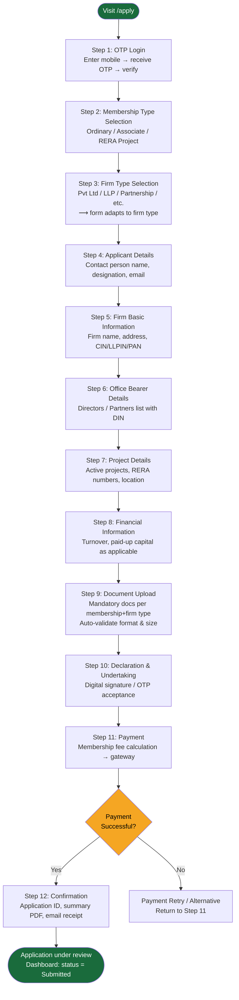
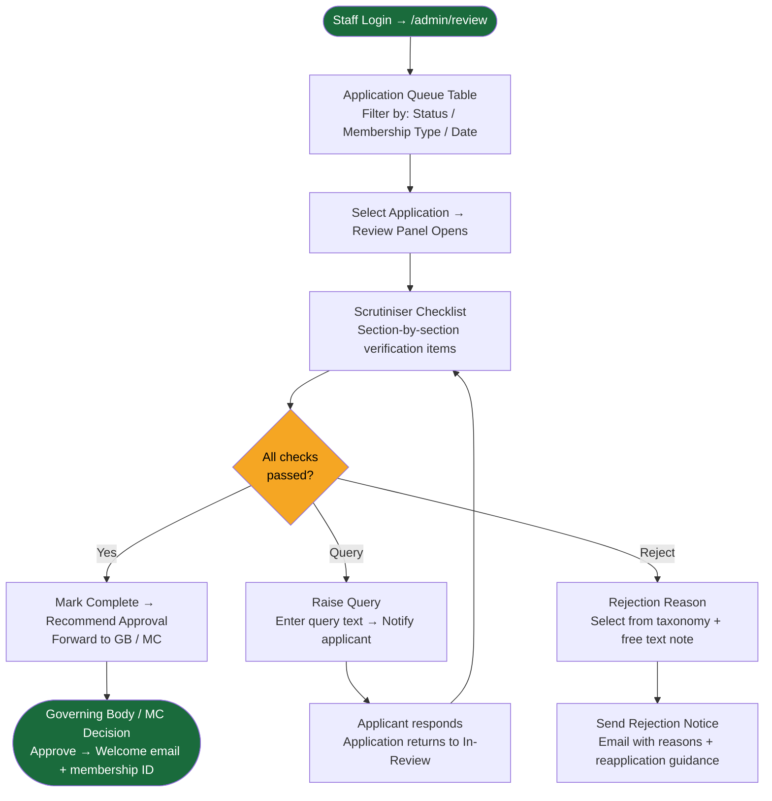

# UX Design Specification Credai

**Author:** Aayush Makhija
**Date:** 2026-04-24

---

## Executive Summary

### Project Vision

Credai is a digital member portal for CREDAI Pune that replaces a paper-heavy, manually-verified membership process with a self-serve lifecycle web application. It serves applicant firms (real-estate builders/developers seeking certification) and CREDAI Pune office staff (who review, verify, and govern membership). Scope spans the full member lifecycle: new-member application across three membership types (Ordinary, Associate, RERA Project), renewals, document vault, and ongoing member access — geographically scoped to Pune district (PMC, PCMC, PMRDA).

### Target Users

**Applicant Firms (Builders/Developers):** Real-estate firms of varying legal structures (Proprietorship, Partnership, Private Limited, LLP, Public Sector, AOP, Co-operative Society) applying for CREDAI Pune membership. Semi-tech-savvy business professionals completing this process infrequently; they need a guided, mistake-proof experience with clear progress and document expectations upfront.

**CREDAI Pune Office Staff:** Reviewers who process applications, cross-check identity (PAN/Aadhaar), tax (GST), and regulatory (RERA, Code of Conduct) documents, manage approvals/rejections, and reconcile payments. Their primary UX need is efficiency, scannability, and zero re-keying.

**Existing Members:** Renewing membership annually and managing their document vault. Pre-filled data from prior submissions is a key expectation.

### Key Design Challenges

1. **Taming conditional complexity** — The 3 Membership Types × 7 Firm Types matrix creates radically different wizard paths. Every branch must feel tailored and guided, never generic or trap-laden.
2. **Document-readiness anxiety** — 10–15+ mandatory uploads vary by firm type. Users need a "what you'll need" pre-flight checklist before committing to the wizard to prevent mid-session abandonment.
3. **Multi-session continuity** — Physical document dependencies (stamped Code of Conduct, signed Proposer/Seconder form) mean most users cannot complete in one sitting. Draft-save and trustworthy progress state are essential.
4. **Dual-audience split** — Applicant UX (guided, reassuring) and Staff UX (efficient, scannable, action-oriented) require different design surfaces and information hierarchies.
5. **Compliance without intimidation** — Regulatory in nature (RERA, GST, PAN, Code of Conduct), the UI must communicate legitimacy without feeling bureaucratic or punishing on errors.

### Design Opportunities

1. **Pre-flight document checklist** — A smart "documents you'll need" screen based on Membership Type + Firm Type selection, surfaced before the wizard begins, to dramatically improve first-time-right submission rates.
2. **Progressive disclosure as a trust signal** — Showing only fields relevant to the user's choices, elevated into a UX story of "we only ask what matters," builds confidence and reduces cognitive load at each step.
3. **Staff review as a power tool** — A high-efficiency review dashboard with inline verification badges (GST ✓, PAN ✓), document preview, and structured per-application checklists — transforming multi-hour manual review into a focused 30-minute task.

## Core User Experience

### Defining Experience

The defining experience of Credai is the membership application wizard: guiding a first-time applicant firm from OTP login to a successfully submitted, complete, and compliant application package — in as few sessions as possible, with zero doubt about whether they got it right.

The two interactions that make or break this experience are:
1. **Conditional form logic** — users must never encounter a field that doesn't apply to them, and must never be unsure whether a step is relevant. Every screen should feel personally tailored to their Membership Type and Firm Type.
2. **Document upload** — with 10–15+ mandatory uploads across the wizard, the upload experience must be frictionless: clear format/size guidance upfront, reliable upload progress, and easy view/replace/remove controls throughout.

### Platform Strategy

- **Primary platform:** Desktop/laptop web browser
- **Interaction model:** Mouse and keyboard; forms with multi-step wizard navigation
- **Responsive baseline:** Functional on tablet for reference; mobile de-prioritised given document-upload workflow and the office-computer context of the primary user
- **No offline requirement:** Network-dependent (external GST/PAN verification, document uploads)

### Effortless Interactions

These interactions must require zero cognitive effort:

- **Pre-flight document checklist** — Before entering Step 1, show the user exactly which documents they need based on Membership Type + Firm Type. Remove mid-session "I don't have that file" blockers entirely.
- **Conditional field reveal** — Fields appear and disappear silently based on prior selections. Users never see a "N/A" field, never have to wonder if something applies to them.
- **Document upload with inline status** — Upload, see filename + preview link, replace or remove without losing other step progress. No page reloads.
- **Auto-populated read-only fields** — Proposer/Seconder Firm Name fills automatically on member selection. GST/PAN verification status shows inline without a separate lookup step.
- **Draft save and resume** — Progress is preserved automatically. Returning users land on their last incomplete step with all prior data intact.

### Critical Success Moments

- **The "documents ready" moment** — User sees the pre-flight checklist, realises they have everything, and starts the wizard with confidence. This sets the tone for the entire experience.
- **The final submission moment** — User clicks Submit and receives an explicit confirmation: application number, summary of what was submitted, what happens next. The emotional target is **relief + confidence**: "I'm done, and I know this is complete and correct."
- **The first-time-right pass** — Application moves to Staff review without a "missing document" rejection. This is the systemic success moment that validates the entire UX design.
- **Staff review completion** — Reviewer opens an application and has everything needed to make a decision without leaving the screen: all documents accessible inline, verification statuses visible, checklist complete.

### Experience Principles

1. **Guide, don't gate.** The wizard should feel like a knowledgeable guide that shows only what's relevant — not a bureaucratic form that blocks and rejects. Validation errors are helpers, not penalties.
2. **Certainty at every step.** Users should always know: where they are, what they've completed, what's next, and whether what they've entered is correct. Ambiguity is the enemy of completion.
3. **Uploads are first-class citizens.** Document upload is not a secondary "attachment" feature — it is the core action of this product. The upload UX must be as polished as the form fields themselves.
4. **Accuracy before speed (staff surface).** The staff review interface prioritises auditability and completeness over raw throughput. Every decision must be fully evidenced; nothing should be easy to miss.

## Desired Emotional Response

### Primary Emotional Goals

- **Applicants (new):** Move from *Reassured* → *Certain* → *Relieved*
  The arc begins at arrival ("this is official and trustworthy, I'm in the right place"), builds through each completed step ("I know what I'm doing"), and peaks at submission ("I'm done and I got it right").
- **Applicants (returning/renewal):** *Familiarity* — "I've done this before, I know where everything is, most of it is already filled in."
- **Staff reviewers:** *In control* — "I have everything I need in front of me; nothing can be missed, nothing can slip through."

### Emotional Journey Mapping

| Stage | Applicant (New) | Applicant (Renewal) | Staff Reviewer |
|---|---|---|---|
| Arrival | Reassured — official, trustworthy | Familiar — recognised, welcomed back | Focused — clear queue, clear task |
| During wizard | Certain — guided, on track | Efficient — pre-filled, minimal re-entry | In control — all evidence visible |
| On error/block | Guided — "here's exactly what to fix" | Same as new | Alerted — clear flag, clear action |
| At completion | Relief + Confidence | Ease — "that was quick" | Decisive — decision fully evidenced |

### Micro-Emotions

**To cultivate:**
- **Trust** — Official CREDAI branding, professional layout, and explicit security cues (OTP, verified badges) establish legitimacy from the first screen.
- **Confidence** — Step-by-step progress, inline validation, and visible completion states mean users always know they're on track.
- **Relief** — A meaningful submission confirmation (application number, summary, next steps) closes the loop and removes lingering doubt.
- **Familiarity** — For returning members, pre-filled data, consistent layout, and a "welcome back" context signal that the system remembers them.
- **Control (staff)** — Structured review checklists, inline document previews, and verification badges mean reviewers never have to hunt for evidence.

**To prevent:**
- **Anxiety** — Never leave users wondering if their upload succeeded, their progress was saved, or their application was received.
- **Shame/Blame** — Validation errors must read as helpful guidance ("Please upload a PDF or JPG under 5 MB"), never as accusations.
- **Overwhelm** — The conditional wizard exists precisely to prevent users from seeing the full complexity of the 3 × 7 matrix at once.
- **Doubt (staff)** — The review interface must never require a reviewer to second-guess whether they've seen everything; completeness must be visually verifiable at a glance.

### Design Implications

- **Reassurance → Visual design:** Professional, institution-grade aesthetic — CREDAI brand colours, clear typography, structured layout. No consumer-app playfulness; this is a certification process.
- **Guided errors → Copy and microcopy:** All error messages are written in plain English, prescriptive ("Upload a signed PDF"), and positioned inline next to the field. No modal interruptions.
- **Certainty → Progress architecture:** Persistent step indicator always visible. Completed steps show a checkmark. Current step is clearly highlighted. Remaining steps are visible but muted.
- **Relief → Submission confirmation:** The confirmation screen is generous — application reference number, a summary of what was submitted, estimated review timeline, and a contact point for questions. Not just "Success."
- **Familiarity → Renewal UX:** Returning members see their previous data pre-filled with a "Review and confirm" prompt, not a blank form. Changed fields are highlighted. The experience feels like editing, not re-applying.
- **In control → Staff dashboard:** Each application review page has a structured checklist of required items with pass/fail/pending status. Nothing is implicit; everything is accounted for.

### Emotional Design Principles

1. **Trust is earned at the first screen.** The portal's visual tone — official, clean, institutional — must immediately signal legitimacy. Users should feel they are dealing with a credible organisation, not a generic web form.
2. **Errors are guides, not gatekeepers.** Every validation message exists to help the user proceed, not to block them. Tone is always constructive and specific. Users should feel supported when something goes wrong.
3. **Completion deserves ceremony.** Submitting a membership application is a meaningful act for a business. The confirmation experience should honour that — not dismiss it with a single line of text.
4. **Returning users should feel remembered.** Familiarity and pre-fill signal that the system values the member's relationship with CREDAI, not just their data.
5. **Staff must feel nothing can slip.** Every design decision on the review surface should reinforce completeness and accountability — because the emotional cost of a missed document or a wrongly approved application is high for both the reviewer and the organisation.

## UX Pattern Analysis & Inspiration

### Inspiring Products Analysis

Since no direct analogues exist in the Indian trade-association space, inspiration is drawn from three adjacent domains with directly transferable patterns.

#### 1. Stripe Business Onboarding (Multi-step wizard + conditional KYC)
Stripe's business verification wizard is the gold standard for complex, compliance-heavy multi-step forms. Key UX strengths:
- Progressive disclosure: only shows fields relevant to the selected business type (individual, company, non-profit) — the same 3×7 matrix problem Credai faces.
- Inline field validation with constructive, prescriptive error messages.
- Clear step indicator with visible completion states.
- Verification status (bank account, identity) shown inline with colour-coded badges — never a separate lookup.
- Draft persistence: users can leave and return without losing progress.

#### 2. India GST Portal / GSTN (Compliance wizard familiar to target users)
Credai's applicants already use the GST portal for their own filings — making its interaction patterns a familiar baseline. Key observations:
- Structured, section-by-section form layout with clear mandatory field markers.
- Document upload with file-name display and remove option.
- Step-locked navigation: cannot proceed without completing current section.

**However, notable anti-patterns:** dense information layout, poor mobile experience, and generic error messages — all areas where Credai should deliberately exceed this baseline.

#### 3. DocuSign / Document-centric workflows
DocuSign is the reference for making document upload and signing feel trustworthy rather than anxious. Key UX strengths:
- Upload progress indicators that communicate reliability ("your file is safe").
- Document preview inline (no download required to verify the right file was uploaded).
- Clear "uploaded / pending / required" status per document throughout the flow.
- Completion confirmation with reference number and downloadable receipt — the "ceremony" of completion done right.

#### 4. Linear / Structured Review Dashboards (Staff surface reference)
Linear is the reference for the staff review surface — not because it is a compliance tool, but because it demonstrates how to make a review queue feel in-control rather than overwhelming. Key UX strengths:
- Application/item view shows all relevant information in one screen — no tab-switching or separate lookups.
- Status indicators (pass/fail/pending) are immediately scannable.
- Structured checklist within each item ensures nothing is skipped.
- Clear, single-action decision buttons — no ambiguity about what happens next.

### Transferable UX Patterns

**Wizard & Navigation Patterns:**
- **Stripe's entity-type branching** → Credai's Membership Type + Firm Type conditional reveal. Show only what applies; never show a grayed-out or "N/A" field.
- **Step-locked progression with visible step rail** → Persistent step indicator (steps 1–12) always visible; completed steps checked; current step highlighted; future steps muted but visible so users know what's ahead.
- **Draft auto-save with resume landing** → On return, land the user on their last incomplete step with a "Welcome back — you left off at Step 4" banner.

**Document Upload Patterns:**
- **DocuSign's upload-then-preview model** → After upload, show thumbnail + filename + "View" link inline. Users confirm the right file was uploaded without leaving the step.
- **Per-document status chips** → Each required document shows a status chip: "Required", "Uploaded ✓", or "Error — re-upload". Status is visible in the step summary and the review screen.
- **Pre-flight document checklist** → Before Step 1, a summary screen lists all required documents based on the user's Membership Type + Firm Type selection.

**Verification & Trust Patterns:**
- **Stripe's inline verification badges** → GST and PAN verification results appear as colour-coded status chips ("Verified ✓", "Pending", "Failed — check number") directly next to the input field, not in a separate step.
- **GSTN's mandatory-field asterisk convention** → Consistent asterisk (*) or "Required" label on all mandatory fields. Familiar to the target user base.

**Staff Review Patterns:**
- **Linear's single-screen item view** → All application data, document links, and verification statuses on one page. Reviewer never needs to navigate away.
- **Structured review checklist** → A fixed checklist (identity ✓, GST ✓, PAN ✓, Code of Conduct ✓, etc.) that the reviewer works through — not a free-form notes field.

### Anti-Patterns to Avoid

- **GST Portal's dense layout** — Cramming every field onto one screen without visual grouping. Credai must use generous spacing, clear section headers, and visual hierarchy.
- **Generic error messages** — Every error must be specific, prescriptive, and positioned inline.
- **Upload-then-disappear** — Always show filename, size, and a preview link after every document upload.
- **No progress persistence** — All wizard state must be server-persisted, not session-only. Never lose data on browser back or session timeout.
- **Modal-heavy validation** — Blocking popups for every error interrupt flow and increase anxiety. Use inline validation exclusively.
- **Flat review queue for staff** — A plain list of applications with no status and no in-context document access forces tab-switching and increases error rate.

### Design Inspiration Strategy

**Adopt directly:**
- Stripe's conditional field reveal pattern for Membership Type × Firm Type branching.
- DocuSign's upload-preview-status model for all document upload controls.
- Linear's single-screen application review layout for the staff surface.
- Step rail with completion checkmarks for the wizard progress indicator.

**Adapt for Credai's context:**
- Stripe's inline verification badges → Adapt for GST/PAN with Indian regulatory language and CREDAI brand styling.
- DocuSign's pre-signing checklist → Adapt as a "documents you'll need" pre-flight screen specific to each Membership Type + Firm Type combination.
- Linear's review checklist → Adapt with CREDAI-specific compliance items (Code of Conduct, Self Declaration, Proposer/Seconder).

**Deliberately exceed:**
- GST Portal's UX baseline — the target users are already tolerant of poor government portal UX, but Credai has the opportunity to set a new standard for what a compliance process can feel like in India.

## Design System Foundation

### Design System Choice

**Chosen approach:** Themeable component system — **shadcn/ui** over **TailwindCSS**, built on **Next.js + React**.

- **Framework:** Next.js (React) — App Router
- **Styling:** TailwindCSS — utility-first, fully customisable
- **Component library:** shadcn/ui — Radix UI primitives with Tailwind styling, components copied into the codebase for full ownership and customisation
- **Brand theme:** CREDAI green (primary) + red (accent), applied via Tailwind's theme configuration

### Rationale for Selection

1. **shadcn/ui fits the form-heavy wizard perfectly.** Production-ready components for every pattern Credai needs: Select, DatePicker, FileUpload, Badge (status chips), Progress (step indicator), Table (staff review queue), Dialog, and Toast. All on accessible Radix UI primitives.
2. **Full ownership, zero lock-in.** shadcn/ui components are copied directly into the project — every component can be modified to exact requirements (e.g., custom FileUpload with preview and remove controls).
3. **TailwindCSS theming enables institutional brand fidelity.** CREDAI's green and red palette configured once in `tailwind.config.ts` as semantic tokens, applied consistently everywhere.
4. **Next.js App Router fits the dual-surface architecture.** Applicant wizard and Staff review dashboard are separate route groups with different layouts, auth middleware, and data-fetching patterns.
5. **Aligns with the institutional emotional goal.** shadcn/ui's clean, structured, neutral aesthetic is an excellent canvas for CREDAI's institutional brand without consumer-app playfulness.

### Brand Colour Direction

Based on the CREDAI national website (credai.org), the palette centres on:

| Token | Role | Direction | Action |
|---|---|---|---|
| `brand-primary` | Primary actions, active steps, CTAs | CREDAI Green | Confirm hex via devtools on credai.org |
| `brand-accent` | Alerts, important highlights | CREDAI Red | Confirm hex via devtools on credai.org |
| `brand-surface` | Page background | Off-white / light grey | #F8F9FA recommended |
| `brand-text` | Body copy | Near-black | #1A1A1A recommended |
| `success` | Verified ✓, uploaded ✓ | Green (may reuse brand-primary) | TBD |
| `error` | Validation errors, failed verification | Red (may reuse brand-accent) | TBD |
| `muted` | Future/disabled steps, helper text | Grey | #6B7280 (Tailwind gray-500) |

> **Action required before development:** Use browser devtools (F12 → Inspect any green element → Computed → color) on credai.org to extract exact hex values for `brand-primary` and `brand-accent`.

### Implementation Approach

**Tailwind theme extension** (`tailwind.config.ts`):
```ts
theme: {
  extend: {
    colors: {
      brand: {
        primary: '<CREDAI_GREEN_HEX>',   // confirm from credai.org
        accent:  '<CREDAI_RED_HEX>',     // confirm from credai.org
        surface: '#F8F9FA',
        text:    '#1A1A1A',
      }
    }
  }
}
```

**shadcn/ui component priorities** (install and customise in this order):
1. `Form`, `Input`, `Select`, `Checkbox`, `RadioGroup` — wizard form fields
2. `Progress` + custom Step Rail — wizard navigation indicator
3. `Button` — primary (brand-primary), secondary (outlined), destructive
4. File upload component (custom, built on shadcn/ui primitives) — core to wizard
5. `Badge` — document status chips (Required / Uploaded ✓ / Error)
6. `Table`, `Badge`, `Dialog` — staff review queue and application detail view
7. `Toast` / `Alert` — inline validation messages and upload confirmations

### Customisation Strategy

- **Form fields:** All mandatory fields get a consistent asterisk (*) marker and inline error state (red border + error message below). Matches the GSTN convention familiar to target users.
- **Conditional reveals:** Tailwind `hidden` / `block` toggled by React state — fields appear instantly on selection change, no animation delay.
- **Document upload component:** Custom-built on shadcn/ui primitives. Shows: drop zone → upload progress → filename chip with View/Remove actions. Reusable across all 12 wizard steps.
- **Step rail:** Custom component using shadcn/ui `Progress` as base. Shows step number, label, and state (completed ✓ / active / upcoming) across the top of the wizard layout.

## Defining Core Experience

### 2.1 Defining Experience

The defining interaction of Credai is:

> **"Select your membership type and firm type — and the wizard assembles itself around you."**

The moment a user picks "Ordinary Membership" + "Private Limited", the system silently constructs exactly the right path: the correct steps, only the fields that apply, only the documents they need. No grayed-out rows, no "N/A" fields, no paper-form cognitive load. This adaptive assembly is what makes Credai feel fundamentally different from every government compliance portal that preceded it.

Everything else in the UX flows from getting this single interaction right.

### 2.2 User Mental Model

**How users currently approach this:**
Applicants today receive a paper form (or a static PDF) that covers all membership types and firm structures simultaneously. They must manually identify which sections apply to them, skip irrelevant fields, and assemble the correct document set from a long undifferentiated list — with no guidance on what's mandatory for their specific situation. The mental model is: "I'm navigating a complex document and trying to figure out what applies to me."

**What they bring to Credai:**
Users arrive with moderate digital literacy (GST portal, bank portals, email). They are familiar with step-by-step wizards from tax filing and bank KYC flows. They expect: mandatory fields to be marked, document uploads to be clearly labelled, and the system to tell them when something is wrong.

**Where they expect to get confused:**
- "Does this field apply to my firm type?"
- "Which documents do I need to have ready?"
- "Did my upload actually work?"
- "Can I come back to this later without losing my work?"

Credai's UX must answer all four questions before the user has to ask them.

### 2.3 Success Criteria for Core Experience

The adaptive wizard succeeds when:

1. **Zero irrelevant fields shown.** A Partnership-firm applicant never sees the ROC Number field. An Associate Member never sees Completed Projects. Every field on screen is directly relevant to the user in front of it.
2. **Document readiness achieved before Step 1.** The expandable "Documents you'll need" panel in Step 1 — pre-populated based on Membership Type + Firm Type — means users know their complete document list before they type a single character.
3. **Autosave is invisible and reliable.** Users never think about saving. They close the tab, come back the next day, and land exactly where they left off. A subtle "Saved ✓" chip bottom-right appears for 2 seconds after each save.
4. **Back-navigation preserves all data.** Clicking a completed step in the step rail opens it with all previously entered data intact. Editing a step clears downstream data only when a field dependency requires it (e.g., changing Firm Type clears firm-specific uploads) — with a clear warning before doing so.
5. **Submit is only enabled when everything is complete.** The Submit button is disabled and greyed until all mandatory steps are fully valid. The step rail shows an error indicator on any incomplete step so users always know what's blocking them.

### 2.4 Novel vs. Established Patterns

The conditional-reveal pattern is **established** — progressive disclosure based on user selections is well-understood (Stripe onboarding, tax filing wizards). Users will not need to be taught this interaction.

**What is novel for this domain:**
- **Pre-flight document panel inside Step 1** — dynamically generated document checklist as an expandable panel at the top of the first step. New for Indian compliance workflows but immediately recognisable.
- **Step rail with error state** — red error indicator on a completed step if a validation issue is found later. Intuitive but uncommon in Indian government portals.

**Familiar metaphors used:**
- Tax filing wizard (ITR / GSTN) — step-by-step, mandatory fields, document upload
- Bank KYC flow — identity verification with document upload and inline status
- E-commerce checkout — step rail, back navigation, order summary before submit

### 2.5 Experience Mechanics

**1. Initiation — Step 1: CREDAI Form**
- User selects Membership Type then Firm Type from dropdowns.
- On both selections: the expandable "Documents you'll need" panel **updates in real time** — showing the exact document list for this combination with checkboxes the user can tick as they prepare.
- The step rail **updates** — showing the exact steps relevant to this combination (e.g., Associate membership skips Completed Projects step).

**2. Interaction — Wizard Progression**
- Each step shows only the fields and uploads relevant to the user's combination.
- Navigation: **Next** (validates current step, advances) and **Previous** (returns to prior step, data intact). Step rail is always visible; any completed step is clickable to jump back.
- Autosave fires on every Next action and on a 30-second idle interval. A subtle "Saved ✓" chip appears bottom-right for 2 seconds.
- Conditional fields within a step reveal/hide instantly on selection change — no page reload.

**3. Feedback — Inline Validation**
- Field validation fires on blur, not on every keystroke — no premature red states.
- Errors appear as: red field border + red helper text below ("Enter a valid 10-digit mobile number"). Never modal popups.
- Document upload: drop zone turns green with filename + "View" link on success; red with error message on failure.
- GST/PAN verification: spinner → green "Verified ✓" badge or red "Verification failed — check number" badge, inline next to the field.

**4. Completion — Review & Submit**
- Step 12: read-only summary of all entered data. Each section has an "Edit" link navigating back to the relevant step without losing other data.
- Submit enabled only when: all steps complete + declaration checkbox checked.
- On Submit: full-page confirmation with application reference number, submission summary, estimated review timeline ("3–5 business days"), and support contact. User can download a PDF receipt.

## Visual Design Foundation

### Color System

**Semantic token map** (configured in `tailwind.config.ts`):

| Token | Hex | Usage |
|---|---|---|
| `brand-primary` | `<CREDAI_GREEN>` ¹ | Primary buttons, active step, links, focus rings |
| `brand-primary-hover` | `<CREDAI_GREEN -10% lightness>` | Button hover state |
| `brand-primary-subtle` | `<CREDAI_GREEN 10% opacity>` | Active step rail background, selected row highlight |
| `brand-accent` | `<CREDAI_RED>` ¹ | Destructive actions, critical alerts, badge highlights |
| `brand-surface` | `#F8F9FA` | Page background, wizard container background |
| `brand-surface-card` | `#FFFFFF` | Step card background, form panel background |
| `brand-border` | `#E2E8F0` | Input borders, dividers, card borders |
| `brand-text` | `#1A1A1A` | Body copy, field labels, headings |
| `brand-text-muted` | `#6B7280` | Helper text, placeholder text, disabled labels |
| `success` | `#16A34A` | Verified ✓ badge, uploaded ✓ chip, completed step checkmark |
| `success-subtle` | `#F0FDF4` | Verified field background tint |
| `error` | `#DC2626` | Validation error text, error field border, failed verification badge |
| `error-subtle` | `#FEF2F2` | Error field background tint |
| `warning` | `#D97706` | Pending verification badge, incomplete step indicator |
| `muted` | `#F1F5F9` | Disabled fields, upcoming (locked) step rail items |

> ¹ Confirm exact hex from credai.org using browser devtools before development.

**Accessibility:** All text/background combinations must meet WCAG AA (4.5:1 contrast for body text, 3:1 for large text and UI components). Run contrast checks once `brand-primary` hex is confirmed.

### Typography System

**Typeface: Inter** (shadcn/ui default; no client font constraint)
- Highly legible at small sizes — ideal for dense form labels
- Excellent numeral rendering for GST/PAN/Aadhaar fields
- Available via `next/font/google` with zero layout shift

**Type scale:**

| Role | Size | Weight | Usage |
|---|---|---|---|
| Page title | 24px / `text-2xl` | 600 | Wizard step heading |
| Section heading | 18px / `text-lg` | 600 | Form section labels |
| Field label | 14px / `text-sm` | 500 | All form field labels |
| Body / input | 14px / `text-sm` | 400 | Input values, dropdown text |
| Helper / error text | 12px / `text-xs` | 400 | Field hints, validation messages |
| Button | 14px / `text-sm` | 500 | All buttons |
| Step rail label | 12px / `text-xs` | 500 | Step names below step numbers |

**Mandatory field marker:** Asterisk (*) in `brand-accent` (red), after the label. Consistent with GSTN conventions familiar to target users.

### Spacing & Layout Foundation

**Base unit:** 4px (Tailwind default). All spacing in multiples of 4px.

**Wizard page layout:**
```
┌─────────────────────────────────────────────────────┐
│  Header: CREDAI logo + portal name          [User ▾] │  h-16 (64px)
├─────────────────────────────────────────────────────┤
│  Step Rail: Step 1 ✓ → Step 2 ✓ → Step 3 ● → ...  │  h-20 (80px)
├─────────────────────────────────────────────────────┤
│  [Wizard Content Area — max-w-4xl, mx-auto, px-6]   │
│  Step title + description          [Autosave chip]  │
│  [Documents You'll Need ▾ expandable panel]         │  Step 1 only
│  Form Section Heading                               │
│  [Field]          [Field]          [Field]          │  3-col grid
│  [Field]          [Field]                           │  2-col grid
│  [File Upload Control — full width]                 │
├─────────────────────────────────────────────────────┤
│  [← Previous]                    [Next Step →]      │  py-6
└─────────────────────────────────────────────────────┘
```

**Grid:** 3-column (`grid-cols-3 gap-4`) for short fields. 2-column (`grid-cols-2 gap-4`) for medium fields. Full-width (`col-span-3`) for file upload controls, text areas, and section headings.

**Card / form panel:** `bg-white rounded-lg border border-brand-border p-6 mb-6` — each logical form section is a distinct card.

**Vertical rhythm:**
- Between form cards: `mb-6` (24px)
- Between field label and input: `mb-1` (4px)
- Between fields within a grid row: `gap-4` (16px)
- Section heading to first field: `mt-4 mb-3`

### Accessibility Considerations

- **Focus rings:** `focus-visible:ring-2 focus-visible:ring-brand-primary` on all interactive elements. Never remove focus outlines.
- **Error association:** All error messages linked to their field via `aria-describedby`. Screen readers announce the error on field focus.
- **Required fields:** `aria-required="true"` on all mandatory inputs, in addition to the visual asterisk marker.
- **Upload controls:** Keyboard-accessible drop zones with `role="button"` and `aria-label` describing the expected document.
- **Step rail:** `aria-current="step"` on the active step. Completed steps marked with `aria-label="Step N — [name] — Completed"`.
- **Colour independence:** Status communicated by both colour and icon/text — never colour alone.
- **Minimum tap/click target:** 44×44px for all interactive controls (WCAG 2.5.5).

## Design Direction Decision

### Design Directions Explored

Four directions were generated and evaluated:
- **A — Structured Authority:** Institutional green header, horizontal step rail, section cards
- **B — Clean Minimal:** White surfaces, dot progress indicator, SaaS aesthetic
- **C — Bold Dashboard:** Dark sidebar with full 12-step list, enterprise app layout
- **D — Staff Review Dashboard:** Application queue with inline verification + structured review checklist panel

### Chosen Direction

**Hybrid: A + C for the applicant wizard, D for the staff surface.**

**Applicant wizard layout:**
- Header: Direction A's institutional green header (CREDAI brand, user identity pill)
- Step navigation: Direction C's dark sidebar step list — replaces horizontal rail
- Form surface: Direction A's section cards, 3-column grid, inline verification badges
- Document upload: Direction A's filename chip with View/Remove actions
- Footer: Direction A's Previous / Next button bar with autosave indicator

**Staff review surface:**
- Direction D as designed: application queue table with GST/PAN verification badges + side review panel with structured checklist and Approve/Query/Reject actions

### Design Rationale

1. **Sidebar replaces horizontal rail for a 12-step wizard.** A horizontal step rail works well for 3–5 step flows but becomes cramped and hard to scan at 12 steps. Direction C's sidebar solves this decisively — all steps are visible, labelled, and clickable at all times.
2. **A's institutional tone is right for the compliance context.** The green header and card-based form sections signal authority and trustworthiness, matching the "Reassured" emotional goal at first arrival.
3. **D is the strongest possible staff surface.** The split-panel layout means reviewers never leave the page to verify a document. The fixed checklist ensures nothing is missed.
4. **Shared design tokens.** Both surfaces use the same Tailwind brand tokens, ensuring visual coherence despite different layout structures.

### Implementation Approach

**Applicant wizard shell (`/apply/[step]`):**
```
┌────────────────────────────────────────────────────────┐
│  [Green Header — CREDAI logo + user pill]              │
├──────────────┬─────────────────────────────────────────┤
│  Dark        │  Step title + form content             │
│  Sidebar     │  (Section cards, 3-col grid,           │
│  Step List   │   uploads, verification badges)        │
│  (C style)   │                                        │
│              ├─────────────────────────────────────────┤
│              │  [← Previous]  [Autosave ✓]  [Next →]  │
└──────────────┴─────────────────────────────────────────┘
```

**Staff review shell (`/admin/review`):**
```
┌──────────────┬─────────────────────┬──────────────────┐
│  White       │  Application queue  │  Review panel    │
│  Sidebar Nav │  table with filters │  (checklist +    │
│  (D style)   │  and status badges  │   doc links +    │
│              │                     │   decisions)     │
└──────────────┴─────────────────────┴──────────────────┘
```

---

## User Journey Flows

### Journey 1: New Member Application (First-Time Applicant)

**Persona:** Firm representative (Director / Admin Manager) applying for Ordinary membership for the first time.

**Entry point:** `credai.org` → "Apply for Membership" CTA → `/apply`



**Key UX considerations:**
- Silent auto-save after every field blur — no explicit "Save Draft" button required
- Progress sidebar (Direction C dark rail) always visible — shows completed / current / upcoming steps
- Conditional field groups appear inline; no page reload on membership/firm-type change
- Document upload shows per-document status (Uploaded ✓, Format Error ✗, Pending)
- Payment step clearly shows fee breakdown before gateway redirect

---

### Journey 2: Returning Applicant — Resume Draft

**Persona:** Same firm representative returning after an incomplete session.

**Entry point:** Email reminder link → OTP login → auto-redirect to draft

```mermaid
flowchart TD
    A([Email link / Direct visit]) --> B[OTP Login\nSame mobile number as original session]
    B --> C{Draft exists?}
    C -- Yes --> D[Resume Banner\n"You have an incomplete application\nfor Ordinary Membership — 60% complete"]
    D --> E[Click Resume → Jump to\nlast incomplete step]
    E --> F[Continue from Step N\nAll previous data preserved]
    F --> G[Complete remaining steps]
    G --> H[Submit Application]
    C -- No --> I[Fresh Application Start\nStep 1 flow]

    style A fill:#1a6b3c,color:#fff
    style H fill:#1a6b3c,color:#fff
```

**Key UX considerations:**
- Resume banner appears immediately post-login if a draft exists — single CTA "Resume Application"
- Step rail shows completed steps in green, incomplete in muted state, current highlighted
- Any pre-filled data from previous session is locked unless user explicitly edits — reduces accidental overwrite
- User can jump to any completed step via sidebar to review or correct before final submission

---

### Journey 3: Staff Review & Decision (Scrutiniser)

**Persona:** CREDAI Pune Scrutiniser reviewing a submitted application.

**Entry point:** Staff login → `/admin/review` queue



**Key UX considerations:**
- Three-column layout (Direction D): nav sidebar | queue table | review panel
- Checklist items map directly to SRS business rules — each check has a document link embedded
- Query flow sends an in-app notification and email; applicant's response appears inline in the review thread
- Status badges (Submitted / In Review / Query Raised / Approved / Rejected) use semantic color from design system
- Bulk actions for queue management: assign to reviewer, export list

---

### Journey 4: Member Renewal

**Persona:** Existing Ordinary member approaching annual renewal.

**Entry point:** T-30 email reminder → dashboard renewal CTA → `/renew`

```mermaid
flowchart TD
    A([T-30 Reminder Email]) --> B[Member Login → Dashboard\nRenewal banner: "Renew by DD/MM/YYYY"]
    B --> C[Click Renew → /renew]
    C --> D[Pre-filled Renewal Form\nAll existing data loaded]
    D --> E{Data changes\nneeded?}
    E -- No changes --> F[Review & Confirm\n1-page summary of current details]
    E -- Update needed --> G[Edit specific sections\nOnly changed fields flagged for re-review]
    G --> F
    F --> H[Document Refresh\nUpload only expired/changed documents]
    H --> I[Declaration Re-acceptance\nOTP or digital sign]
    I --> J[Renewal Payment\nPro-rated or full year fee]
    J --> K{Payment\nOK?}
    K -- Yes --> L([Renewal Confirmed\nUpdated membership certificate\nNew expiry date])
    K -- No --> M[Retry Payment]
    M --> J

    style A fill:#1a6b3c,color:#fff
    style L fill:#1a6b3c,color:#fff
    style K fill:#f5a623,color:#000
```

**Key UX considerations:**
- Pre-filled data dramatically reduces friction — member only touches what has changed
- Expired documents are flagged automatically with a red badge — member sees exactly what needs updating
- T-15 second reminder triggers if no action taken after T-30 reminder
- On-time renewal preserves continuous membership ID — late renewal triggers grace-period workflow

---

### Journey Patterns Summary

| Pattern | Applied in | Implementation |
|---|---|---|
| OTP-gated entry | All journeys | Mobile OTP → session cookie; no password |
| Silent auto-save | New application, renewal | Debounced field-level API call; "Saved ✓" micro-indicator |
| Jump navigation | All wizard flows | Sidebar step rail; completed steps clickable |
| Inline conditional fields | Step 3–8 (new application) | React controlled state; no page reload |
| Status-driven queue | Staff review | Real-time badge updates via polling or SSE |
| Pre-filled data | Renewal, resume draft | Load from DB on session init; user edits override |
| Query thread | Staff → applicant | Threaded comments per application; email + in-app |

---

### Flow Optimisation Principles

1. **Minimum viable input per step** — each wizard step captures one logical concern; never more than ~8 fields visible at once
2. **Never lose work** — auto-save guarantees no data loss on browser close, network drop, or tab switch
3. **Contextual progress signal** — sidebar step rail answers "where am I, what's left, what's done" at a glance
4. **Error recovery at the point of error** — inline validation with specific remediation text; no full-form resubmit to see errors
5. **Staff efficiency first in review** — keyboard-accessible checklist; single-page review without modal chains

---

## Component Strategy

### Design System Components (shadcn/ui)

**Priority Tier 1 — wizard data entry (Steps 3–10 of application):**
`Form`, `Input`, `Select`, `Checkbox`, `RadioGroup`, `Textarea`, `Button`, `Card`, `Alert`, `Separator`

**Priority Tier 2 — feedback and status:**
`Badge`, `Toast`/Sonner, `Progress`, `Skeleton`, `Dialog`, `AlertDialog`

**Priority Tier 3 — staff dashboard:**
`Table`, `Tabs`, `DropdownMenu`, `Command` (search/filter)

All shadcn/ui components configured with Credai brand tokens: `--primary` → CREDAI green, `--destructive` → CREDAI red. No hardcoded hex values in components.

### Custom Components

#### `<WizardStepRail />`

**Purpose:** Fixed dark sidebar listing all 12 wizard steps; orients user throughout the application.

**Anatomy:** Dark panel (`bg-gray-900`) | step number circle | step label | connector line

**States per step:** `completed` (green check circle, clickable) | `current` (white ring, bold label) | `upcoming` (muted, non-interactive) | `error` (red indicator on validation failure)

**Behaviour:** Completed steps are clickable for jump navigation. All 12 steps are mandatory — upcoming steps become interactive only after prior step is complete.

**Variants:** Collapsed rail (icon-only, 56 px wide) for narrow viewports; expanded (240 px) default.

**Accessibility:** `role="navigation"`, `aria-label="Application steps"`, `aria-current="step"` on current item, keyboard arrow-key navigation between completed steps.

---

#### `<DocumentUploadCard />`

**Purpose:** Single-slot upload control for one required document — shows upload status and remediation.

**Anatomy:** Document label + requirement note | drop zone / file picker | status badge | remove/replace action

**States:** `empty` (dashed border) | `uploading` (progress ring + file name) | `uploaded` (green check, file name, size, replace link) | `format-error` (red — "PDF only — .docx not accepted") | `size-error` (red — "Max 5 MB — file is 7.2 MB")

**Accessibility:** `aria-live="polite"` on status zone so screen readers announce state changes without focus loss.

---

#### `<ApplicationStatusTimeline />`

**Purpose:** Shows application lifecycle visually on the applicant dashboard and staff review panel.

**Anatomy:** Horizontal track of labelled nodes: Submitted → Verification → Query (conditional) → Governing Body → Decision

**States per node:** `completed` (filled green circle) | `active` (pulsing ring) | `skipped` (grey) | `blocked` (orange — query raised)

**Variants:** Compact (badges only) for table rows; full (with dates and actor names) for detail views.

---

#### `<QueryThread />`

**Purpose:** Staff-applicant communication thread within a review panel — maintains audit trail.

**Anatomy:** Thread container | message bubble (staff query, blue) | message bubble (applicant response, green) | new query input | send button

**States:** `open` (pending applicant response) | `responded` (applicant replied, staff can close or reply) | `closed` (resolved, read-only)

**Accessibility:** Messages announced via `aria-live="polite"`; timestamp and author in accessible text.

---

#### `<FeeSummaryCard />`

**Purpose:** Displays calculated membership fee breakdown before payment gateway redirect.

**Anatomy:** Line items (Base fee | Late fee if applicable | GST) | total row (bold) | "Proceed to Payment" CTA | Terms link

**States:** `calculating` (skeleton) | `ready` (populated amounts) | `error` (calculation failed, retry)

---

#### `<ReviewChecklistPanel />`

**Purpose:** Staff scrutiniser checklist — section-grouped verification tasks with embedded document links.

**Anatomy:** Section accordion (Firm Details | Documents | Financial | Declarations) | checklist item per SRS rule | document link per item | "Raise Query" action per item

**States per item:** `unchecked` | `passed` (green) | `flagged` (orange, query raised) | `failed` (red, rejection trigger)

**Accessibility:** `role="list"` / `role="listitem"` structure; keyboard-operable check toggle.

---

#### `<AutoSaveIndicator />`

**Purpose:** Micro-component showing save state — reassures applicant data is safe at all times.

**States:** `idle` (hidden) | `saving` ("Saving…" spinner, muted) | `saved` ("Saved ✓", muted green, fades after 3 s) | `error` ("Save failed — check connection", red, persistent)

**Placement:** Top-right of wizard content area, fixed position.

---

#### `<ConditionalFieldGroup />`

**Purpose:** Field cluster that appears/disappears based on membership type or firm type selection.

**Behaviour:** `framer-motion` fade + slide-down on mount, fade + slide-up on unmount. Reserved space during transition prevents layout shift.

**Accessibility:** `aria-hidden="true"` when collapsed; fields inside become unreachable when hidden.

---

#### `<MemberCertificateCard />`

**Purpose:** Post-approval display of digital membership certificate with print/download actions.

**Anatomy:** CREDAI logo | membership type label | firm name | membership ID | validity dates | QR code | Print | Download PDF

**States:** `loading` (skeleton) | `active` (full display) | `expired` (greyed, renewal CTA overlaid)

---

### Component Implementation Strategy

- All custom components built with shadcn/ui design tokens — no hardcoded hex values
- TailwindCSS utility classes for layout; CVA (class-variance-authority) for variant management, matching shadcn/ui convention
- shadcn/ui `Form` (React Hook Form + Zod) wraps all wizard steps — `ConditionalFieldGroup` integrates within the same `FormProvider` context
- `DocumentUploadCard` uses browser File API; upload via Next.js API route to storage
- `WizardStepRail` driven by a single `useWizardState` hook — single source of truth for completed/current/error states across all 12 steps

### Implementation Roadmap

**Phase 1 — Wizard critical path (required for applicant launch):**
- `<WizardStepRail />` — required for all 12 steps
- `<ConditionalFieldGroup />` — required for Steps 2–3 (membership/firm type branching)
- `<DocumentUploadCard />` — required for Step 9
- `<AutoSaveIndicator />` — required for data safety guarantee
- `<FeeSummaryCard />` — required for Step 11 (payment)

**Phase 2 — Staff review launch:**
- `<ReviewChecklistPanel />` — core staff workflow
- `<QueryThread />` — staff-applicant communication
- `<ApplicationStatusTimeline />` — both applicant dashboard and staff review panel

**Phase 3 — Polish and post-approval:**
- `<MemberCertificateCard />` — post-approval; can ship as static display initially
- Compact variants of Timeline and StepRail for mobile breakpoints
- Keyboard shortcuts for staff review panel (approve / query / reject hotkeys)

---

## UX Consistency Patterns

### Button Hierarchy

**Primary action** (`Button variant="default"`, CREDAI green): One per view maximum. Used for the single most important forward action — "Next Step", "Submit Application", "Confirm Approval".

**Secondary action** (`Button variant="outline"`): Supporting actions — "Previous Step", "Save & Exit", "Download Summary". Never competes visually with primary.

**Destructive action** (`Button variant="destructive"`, CREDAI red): Irreversible or negative actions only — "Reject Application", "Delete Draft". Always requires confirmation dialog before execution.

**Ghost action** (`Button variant="ghost"`): Low-emphasis utilities — "Cancel", "View Details", inline "Replace" on document cards.

**Rule:** Wizard navigation bar always follows: `[← Previous]` (outline) · `[Autosave ✓]` (AutoSaveIndicator) · `[Next →]` (default). Never two primary buttons side-by-side.

### Form Patterns & Validation

**Required fields:** Asterisk (*) adjacent to label, with a single "* Required fields" legend at top of each step — not repeated per field.

**Inline validation trigger:** Validate on field blur (not on keystroke). Error text shown immediately below the offending field, not in a summary banner. Error text states what's wrong then how to fix: "Enter a valid PAN — format should be AAAAA9999A".

**Step submission:** "Next" button triggers validation of all fields in the current step. On error, button stays enabled but scrolls to and focuses the first error field — never silently fails.

**Conditional fields:** When a conditional field group appears due to membership/firm type change, previously entered data in that group is cleared — user sees empty fields with placeholders, not stale values.

**Disabled states in re-visit:** Fields become disabled (not hidden) when re-visiting a completed step in review mode — user can see the value but must click "Edit this step" to modify.

### Feedback Patterns

**Success Toast** (Sonner, bottom-right, 4 s auto-dismiss): Non-critical confirmations — "Step saved", "Document uploaded", "Payment successful". Green accent left border.

**Error Toast** (persistent until dismissed): Async action failures requiring user attention — "Document upload failed — retry". Red accent border. Always includes retry action.

**Warning Alert** (inline `Alert variant="warning"`): Conditions requiring attention before proceeding — "Your session expires in 5 minutes", "Late fee applies after DD/MM/YYYY". Orange/amber.

**Info Alert** (inline `Alert variant="default"`): Contextual guidance — "RERA number format: P52100XXXXX" above the RERA field. Blue/muted.

**Destructive confirmation:** Any destructive action opens `AlertDialog` with title + consequence statement + Cancel (outline, left) + Confirm (destructive, right). Never a browser `confirm()`.

### Navigation Patterns

**Wizard navigation:** `WizardStepRail` (sidebar) is the primary orientation tool. No breadcrumb inside the wizard. Top bar shows: CREDAI logo | Application ID | AutoSaveIndicator | "Exit & Save Draft" link only.

**Completed-step jump:** Clicking a completed step in the rail jumps to that step. Jumping back does NOT reset subsequent steps unless the changed field affects downstream conditional logic (e.g., changing firm type resets firm-type-specific fields).

**Staff navigation:** Direction D left sidebar — icon + label links for Dashboard | Applications | Members | Reports | Settings. Active state: CREDAI green left border + green icon. Collapsible to icon-only on smaller screens.

**In-page anchors (staff review):** `<Tabs>` divide the review panel — "Application Details" | "Documents" | "Checklist" | "Query Thread". Tab state persists while the same application is open.

### Empty States & Loading States

**Empty staff queue:** Illustrated empty state — "No applications match your filters" + "Clear filters" action. Never a blank table.

**Empty document slot:** `<DocumentUploadCard />` in `empty` state — dashed border with upload CTA. Never hidden.

**Loading skeleton:** `<Skeleton />` matches the exact layout of loaded content to prevent layout shift. Used for initial queue table load, review panel load, and fee calculation.

**First-time applicant dashboard:** Prompt state — "Start your membership application" CTA + brief eligibility note. Not a blank dashboard.

### Modal & Overlay Patterns

**Confirmation dialogs** (`AlertDialog`): All destructive/irreversible actions. Always two-button: Cancel (outline, left) + Confirm (destructive or primary, right). No X close button — user must choose explicitly.

**Information dialogs** (`Dialog`): "View document" (embedded PDF), "Fee breakdown detail", "Query history". Has X close + "Close" button. Does not require a decision.

**No nested modals:** A dialog never opens a second dialog. Multi-step flows use a step indicator inside a single dialog or navigate to a dedicated page.

### Search & Filtering Patterns

**Staff queue filter bar:** Persistent row above the application table. Filters: Status (multi-select Badge pills) | Membership Type (Select) | Assigned Reviewer (Select) | Date Range. "Clear all" link appears only when at least one filter is active.

**Active filter chips:** Dismissible `Badge` chips below the filter bar — each chip has × to remove that individual filter.

**Free-text search:** Debounced input (300 ms) for firm name / application ID. Results update in-place; no "Search" button needed.

---

## Responsive Design & Accessibility

### Responsive Strategy

**Desktop-first, tablet-tolerant, mobile-graceful.**

The wizard and staff review surfaces are designed primarily for 1280 px+ laptop screens. The design direction (Direction C dark sidebar for wizard + Direction D 3-column staff layout) is inherently desktop-native.

**Desktop (≥ 1024 px) — primary target:**
- Wizard: `WizardStepRail` expanded (240 px) + content area fills remaining width; 3-column field grid for short fields, 2-column for medium
- Staff: full 3-column layout (nav sidebar 220 px | queue table | review panel)
- Document viewer opens inline in the review panel at this width

**Tablet (768–1023 px) — supported, simplified:**
- Wizard: `WizardStepRail` collapses to icon-only (56 px); field grid drops to 2-column max
- Staff: nav sidebar collapses to icon-only; queue table + review panel remain as two columns
- Touch targets ≥ 44 × 44 px for all interactive elements

**Mobile (< 768 px) — functional, not optimised:**
- Wizard: `WizardStepRail` hides behind a "Steps" drawer (floating button); single-column form layout
- Staff: not expected as primary workflow; degrades to full-width table → tap opens review as full-screen overlay
- File upload reverts to button-only (no drag-and-drop); uses native file picker

### Breakpoint Strategy

Using TailwindCSS default breakpoints:

| Breakpoint | Tailwind prefix | Min width | Layout change |
|---|---|---|---|
| Mobile | (default) | 0 px | Single column, collapsed sidebar |
| Tablet (`sm:`) | `sm:` | 640 px | 2-column forms, icon rail |
| Laptop (`md:`) | `md:` | 768 px | Expanded rail, 2-col content |
| Desktop (`lg:`) | `lg:` | 1024 px | Full 3-col layouts — primary target |
| Wide (`xl:`) | `xl:` | 1280 px | Max content width cap (1440 px) |

All Tailwind utility classes written mobile-first; larger breakpoints override. No `max-width` media queries.

### Accessibility Strategy

**Target: WCAG 2.1 Level AA** — industry standard, covers legal obligations for a public-facing government-adjacent portal.

**Colour contrast:**
- Normal text (< 18 pt): ≥ 4.5 : 1 against background
- Large text (≥ 18 pt / bold ≥ 14 pt): ≥ 3 : 1
- UI components and focus indicators: ≥ 3 : 1 against adjacent colours
- CREDAI green (`--primary`) must be verified against white and dark sidebar once hex is confirmed via devtools

**Keyboard navigation:**
- Every interactive element reachable and operable via keyboard alone
- Logical tab order follows visual reading order (left → right, top → bottom)
- Skip link: "Skip to main content" visible on focus at top of every page
- Modal/dialog traps focus within the overlay until closed
- `WizardStepRail` completed steps navigable via keyboard arrow keys

**Focus indicators:**
- shadcn/ui default focus ring (`outline-2 outline-offset-2 outline-ring`) retained — not suppressed with `outline-none`
- `--ring` token set to CREDAI green (high contrast on both light and dark surfaces)

**Screen reader support:**
- Semantic HTML throughout: `<main>`, `<nav>`, `<header>`, `<section>`, `<form>`, `<fieldset>`, `<legend>`
- ARIA landmarks: wizard (`role="main"`), step rail (`role="navigation" aria-label="Application steps"`), staff sidebar (`role="navigation" aria-label="Staff navigation"`)
- `aria-live="polite"` on AutoSaveIndicator, DocumentUploadCard status zone, and query thread
- `aria-required="true"` on all required fields
- `aria-describedby` linking error messages to their fields

**Touch targets:** Minimum 44 × 44 px for all buttons, checkboxes, radio inputs, and interactive icons. WizardStepRail step items minimum 48 px height at all breakpoints.

**Forms:** Every `<input>` and `<select>` has an associated `<label>` (not placeholder-only). `autocomplete` attributes on known fields (`autocomplete="organization"`, `"email"`, `"tel"`).

### Testing Strategy

**Automated:**
- `axe-core` integrated into Next.js dev server (via `@axe-core/react`) — console warnings for AA violations during development
- Lighthouse CI in pipeline — accessibility score gate ≥ 90

**Manual keyboard testing:**
- Tab through entire wizard (Steps 1–12) keyboard-only before each release
- Verify focus trap in all dialogs
- Verify jump navigation via WizardStepRail with keyboard

**Screen reader testing:**
- NVDA + Chrome (Windows — matches primary user base)
- VoiceOver + Safari (secondary)
- Test path: OTP login → wizard completion → document upload → submission confirmation

**Colour & contrast:**
- Browser DevTools contrast checker on all text/background combinations
- Colour blindness simulation (Deuteranopia, Protanopia) via Chrome DevTools — verify status badges and error states remain distinguishable without colour alone

**Responsive testing:**
- Chrome DevTools device emulation: 1440 px, 1280 px, 1024 px, 768 px, 375 px
- Real device: laptop (primary), iPad (tablet verification)

### Implementation Guidelines

**Responsive:**
- Use `rem` for font sizes, `%` / `fr` for layout widths, `px` only for borders and fixed minimum heights
- `grid` and `flexbox` for all layouts — no absolute positioning for content flow
- Images use `next/image` with `sizes` attribute for responsive loading
- Drag-and-drop in `DocumentUploadCard` disabled below `md:` breakpoint — falls back to button-only

**Accessibility:**
- Never use `div` or `span` for interactive elements — use `button`, `a`, or `input[type]`
- Never suppress focus ring with `focus:outline-none` without a `focus-visible:` replacement
- All icon-only buttons have `aria-label` describing the action
- Toast notifications use `role="status"` for success/save (polite) and `role="alert"` for errors (assertive)
- Colour is never the sole means of conveying information — status badges always pair colour with text label
