**FR-1 Applicant Sign Up -- Account Creation**

**Description:**\
The system shall allow users to register/login into the application using their email addresses.d

**Fields:**

-   Email Address (mandatory)

-   Send OTP (Button)

-   Enter OTP (Text)

-   Verify OTP (Button)

-   Resend OTP (Button)

-   Change Email (Link)

**Business Rules:**

-   Email Address is mandatory and must be in a valid email format.

-   OTP shall be generated only after clicking **Send OTP**.

-   OTP shall be sent to the entered email address.

-   User must enter the correct OTP to proceed.

-   OTP verification is mandatory to complete login/registration.

-   User can request **Resend OTP** if OTP is not received.

-   User can change the email address before OTP verification.

-   Expired or invalid OTP shall not allow login.

-   OTP validity: 2 minutes

-   OTP resend: Unlimited

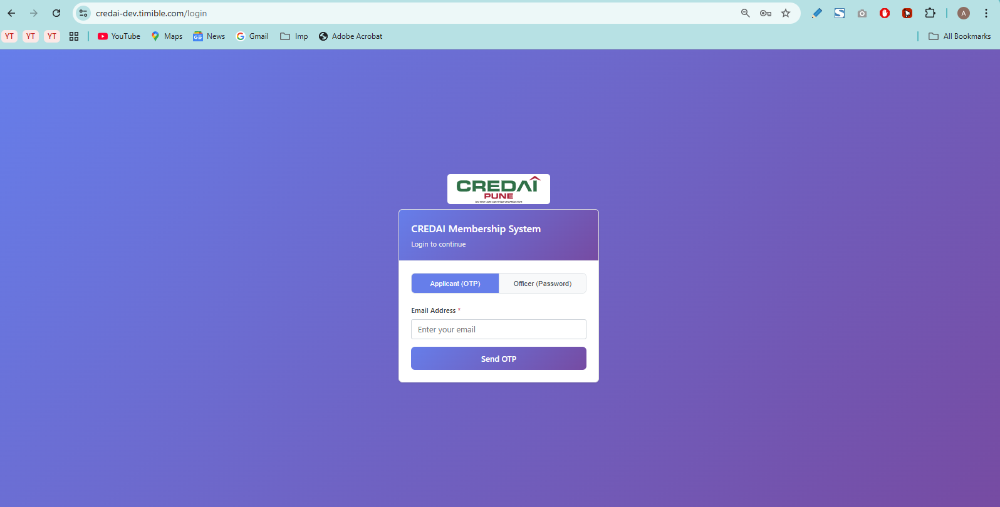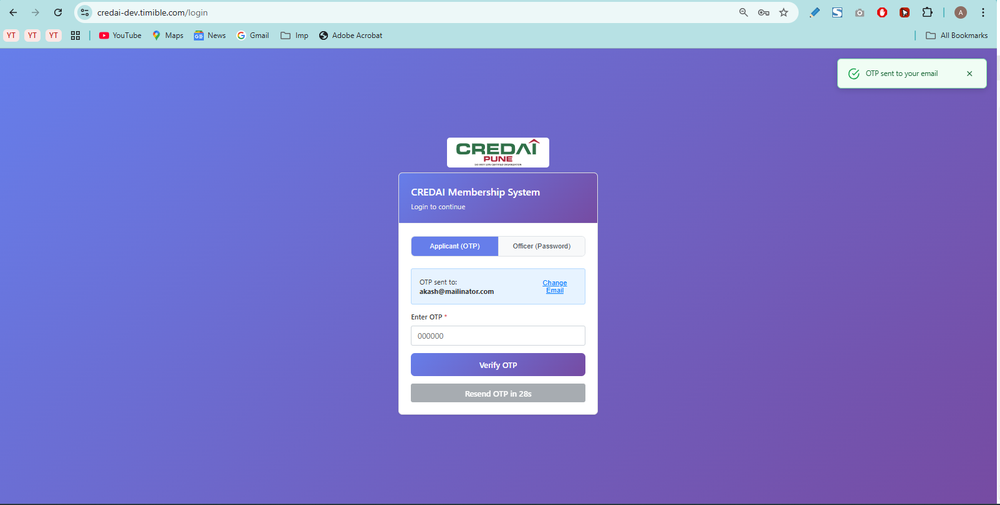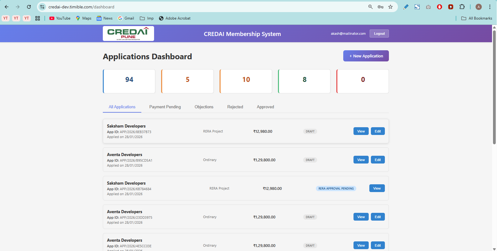

**FR-2 Membership Application Form**\

-   **Step 1 -- CREDAI Form (Membership Type Variations)**

### **Section: Application Header**

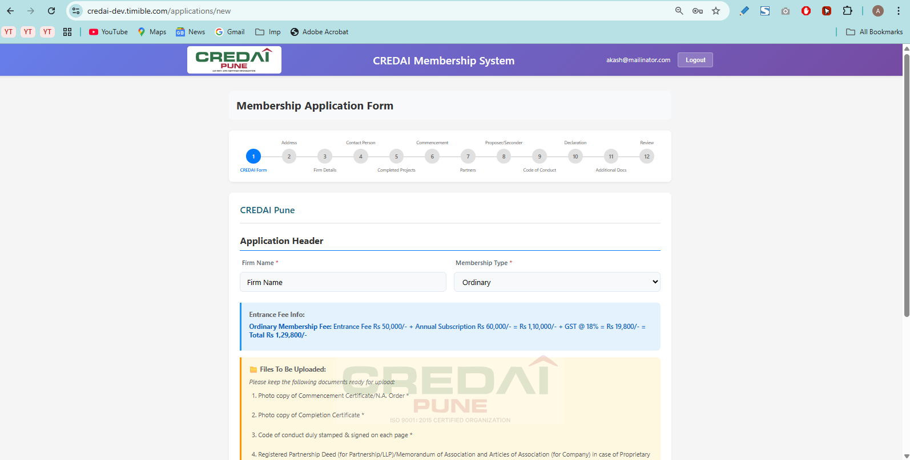

#### **Common Fields (Applicable to All Membership Types):**

-   **Firm Name** *(Mandatory)*

    -   Input Type: Text

    -   Placeholder: Enter Firm Name

-   **Membership Type** *(Mandatory)*

    -   Input Type: Dropdown

    -   Allowed Values:

        -   Ordinary

        -   Associate

        -   RERA Project Membership

## **Membership Type Dropdown list**
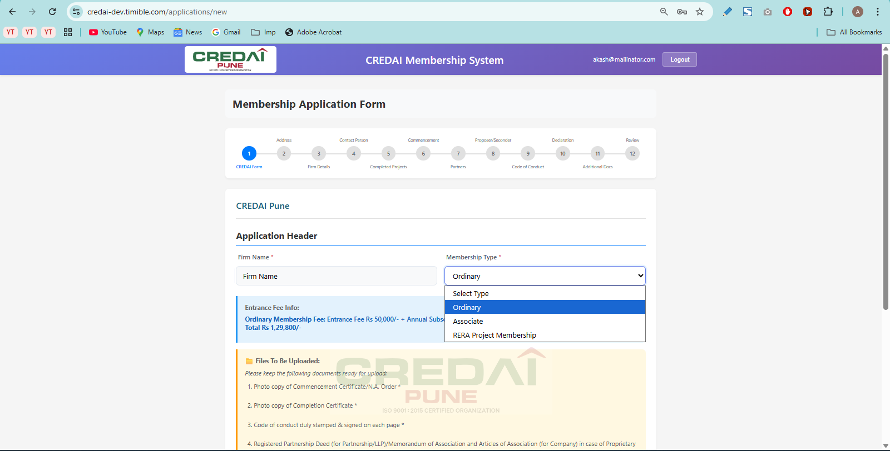

### **1. Ordinary Membership**

#### **Entrance Fee Information:** 

-   Entrance Fee: Rs. 50,000/-

-   Annual Subscription: Rs. 60,000/-

-   Admission Fee: Rs. 10,000/-

-   GST @ 18%: Rs. 19,800/-

-   **Total Amount Payable:** Rs. 1,29,800/-

#### **Files To Be Uploaded:**

-   Photo copy of Commencement Certificate / N.A. Order *(Mandatory)*

-   Photo copy of Completion Certificate *(Mandatory)*

-   Code of Conduct duly stamped & signed on each page *(Mandatory)*

-   Registered Partnership Deed (for Partnership/LLP) **OR**

-   Memorandum & Articles of Association (for Company) **OR**

-   Shop Act Licence (for Proprietorship)

-   PAN Card of Firm *(Mandatory)*

-   PAN & Aadhaar photo copies of Director / Partner / Proprietor / Member *(Mandatory)*

-   GST Registration Certificate *(If Applicable)*

-   Proposer / Seconder File *(Mandatory)*

-   Self Declaration *(Mandatory)*

### **2. Associate Membership**

#### **Additional Fields:**

-   **Select Ordinary Member** *(Mandatory)*

    -   Input Type: Dropdown

    -   Description: Associate members must be associated with an Ordinary Member

#### **Entrance Fee Information:**

-   Entrance Fee: Rs. 2,000/-

-   Annual Subscription: Rs. 5,000/-

-   GST @ 18%: Rs. 1,260/-

-   **Total Amount Payable:** Rs. 8,260/-

#### **Files To Be Uploaded:**

-   Photo copy of Commencement Certificate / N.A. Order *(Mandatory)*

-   Code of Conduct duly stamped & signed on each page *(Mandatory)*

-   Registered Partnership Deed (for Partnership/LLP) **OR**

-   Memorandum & Articles of Association (for Company) **OR**

-   Shop Act Licence (for Proprietorship)

-   PAN Card of Firm *(Mandatory)*

-   PAN & Aadhaar photo copies of Director / Partner / Proprietor / Member *(Mandatory)*

-   GST Registration Certificate *(If Applicable)*

-   Self Declaration *(Mandatory)*

-   Consent Form *(Mandatory)*

### **3. RERA Project Membership**

#### **Entrance Fee Information:**

-   Entrance Fee: Rs. 1,000/-

-   Project Subscription: Rs. 10,000/-

-   GST @ 18%: Rs. 1,980/-

-   **Total Amount Payable:** Rs. 12,980/-

#### **Files To Be Uploaded:**

-   Photo copy of Commencement Certificate / N.A. Order *(Mandatory)*

-   Code of Conduct duly stamped & signed on each page *(Mandatory)*

-   Registered Partnership Deed (for Partnership/LLP) **OR**

-   Memorandum & Articles of Association (for Company) **OR**

-   Shop Act Licence (for Proprietorship)

-   PAN Card of Firm *(Mandatory)*

-   PAN & Aadhaar photo copies of Director / Partner / Proprietor / Member *(Mandatory)*

-   GST Registration Certificate *(If Applicable)*

-   Self Declaration *(Mandatory)*

### **Common File Upload Rules:**

-   All mandatory documents must be uploaded before proceeding to the next step.

-   Supported file formats and size limits should be validated at upload time.

-   If any mandatory document is missing, the system should block navigation and display an error message.

###  **Business Rules -- Membership Type Eligibility:**

1.  A **new applicant can apply only for Ordinary Membership** when submitting a membership application for the first time.

2.  The **Associate Membership application shall be allowed only after the applicant's firm becomes an approved Ordinary Member**.

3.  Once the applicant's **Ordinary Membership is approved**, the firm will automatically appear in:

    a.  The **Ordinary Members list**

    b.  The **Proposer dropdown list**

    c.  The **Seconder dropdown list**

4.  Only firms that already have **approved Ordinary Membership** shall be eligible to submit an **Associate Membership application**.

5.  While applying for **Associate Membership**, the applicant must select an **existing Ordinary Member** from the dropdown list in the **"Select Ordinary Member"** field.

6.  The system must ensure that:

    a.  Associate membership cannot be applied without having **Ordinary Membership first**.

    b.  The **Ordinary Member list in the dropdown** should display **only approved Ordinary Members**.

7.  If the applicant **does not have an approved Ordinary Membership**, the system should **disable or restrict the Associate Membership option**.

### **Navigation Rules:**

-   User can proceed to the next step only after completing all mandatory fields and uploads.

-   Progress indicator should highlight **Step 1 -- CREDAI Form** as active during this stage.

## **Step 2 -- Address**
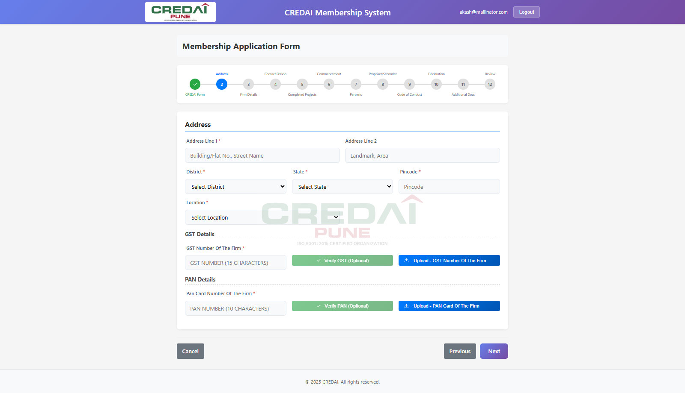

### **Address Details:**
#### **Fields:**
-   **Address Line 1** *(Mandatory)*

    -   Input Type: Text

-   **Address Line 2** *(Mandatory)*

    -   Input Type: Text

-   **District**

    -   Input Type: Dropdown

    -   Default Option: Select District

    -   Values: Pune

-   **State**

    -   Input Type: Dropdown

    -   Default Option: Select State

    -   Value: Maharashtra

-   **Pincode**

    -   Input Type: Numeric

    -   Length: 6 digits

-   **Location**

    -   Input Type: Dropdown

    -   Default Option: Select Location

    -   Values: PMC, PCMC, PMRDA

### **GST Details:**
#### **Fields:**
-   **GST Number of the Firm** *(Mandatory)*

    -   Input Type: Alphanumeric

    -   Format: 15 characters (as per GST standard)

#### **Actions:**
-   **Verify GST***(Mandatory)*

    -   Validates GST number via external verification service

-   **Upload -- GST Number of the Firm***(Mandatory)*

    -   Mandatory document upload for GST certificate

### **PAN Details:**
#### **Fields:**
-   **PAN Card Number of the Firm** *(Mandatory)*

    -   Input Type: Alphanumeric

    -   Format: 10 characters (PAN format)

#### **Actions:**
-   **Verify PAN** *((Mandatory)*

    -   Validates PAN number via external verification service

-   **Upload -- PAN Card of the Firm***(Mandatory)*

    -   Mandatory document upload for PAN card

### **Business Rules:**
-   All mandatory address fields must be completed to proceed.

-   **District, State, and Location** values must be selected from system-configured dropdown lists.

-   Pincode must be a valid 6-digit number.

-   GST and PAN verification buttons are optional but upload of respective documents is mandatory.

### **Navigation Rules:**
-   Clicking **Next** should navigate to **Step 3 -- Firm Details** only after successful validation.

-   Clicking **Previous** should navigate back to **Step 1 -- CREDAI Form**.

-   Clicking **Cancel** should discard changes and exit the application flow.

-   Progress indicator should highlight **Step 2 -- Address** as active.

## **Step 3 -- Firm Details**
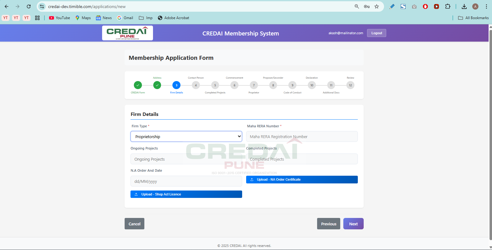

### **Firm Details Section**
#### **Common Fields (Applicable to All Firm Types):**
-   **Firm Type** *(Mandatory)*

    -   Input Type: Dropdown

    -   Default Option: Select Firm Type

    -   Allowed Values:

        -   Proprietorship

        -   Partnership

        -   Private Limited

        -   LLP

        -   Public Sector

        -   AOP

        -   Co-operative Society

-   **Maha RERA Number**

    -   Input Type: Alphanumeric / Numeric

-   **Ongoing Projects** *- Only for Membership type Ordinary & Associate*

    -   Input Type: Numeric

-   **Completed Projects** *- Only for Membership type Ordinary & Associate*

    -   Input Type: Numeric

-   **N.A. Order and Date** - *Only for Membership type Ordinary & Associate*

    -   Input Type: Date

-   **Upload -- N.A. Order Certificate** - *Only for Membership type Ordinary & Associate*

    -   File Upload control

### **Firm Type Specific Fields & Uploads:**
#### **1. Proprietorship**
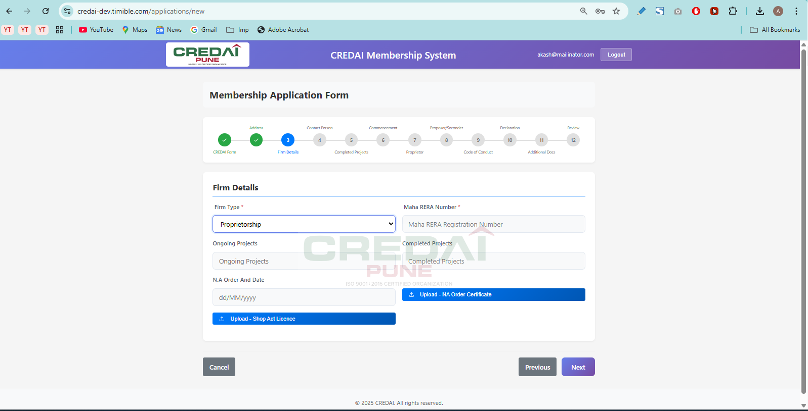

-   **Upload -- Shop Act Licence**

#### **2. Partnership**

-   **Upload -- Registered Partnership Deed**

#### **3. Private Limited**
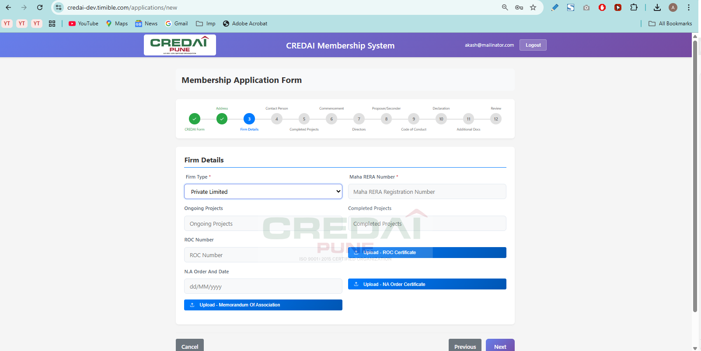

-   **ROC Number**

    -   Input Type: Text

-   **Upload -- ROC Certificate**

-   **Upload -- Memorandum of Association**

#### **4. LLP**
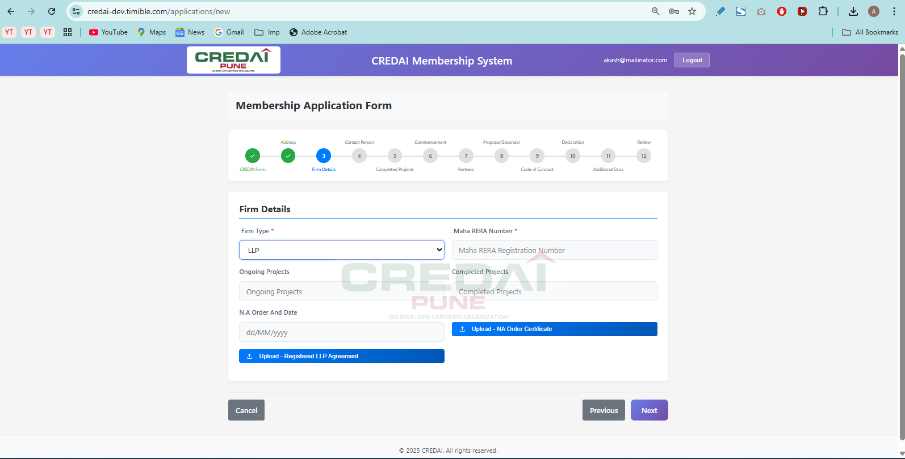

-   **Upload -- Registered LLP Agreement**

#### **5. Public Sector**
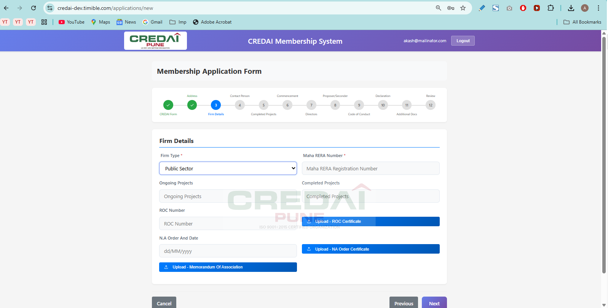

-   **ROC Number**

    -   Input Type: Text

-   **Upload -- ROC Certificate**

-   **Upload -- Memorandum of Association**

#### **6. AOP**
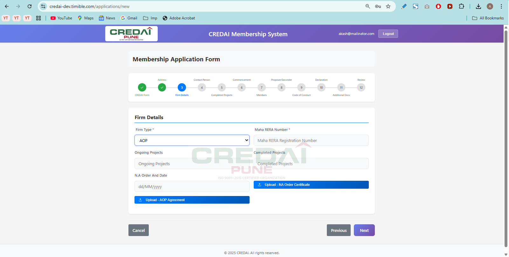

-   **Upload -- AOP Agreement**

#### **7. Co-operative Society**
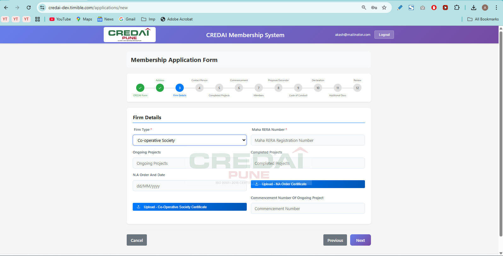

-   **Upload -- Co-operative Society Certificate**

-   **Commencement Number of Ongoing Project**

    -   Input Type: Text

### **Business Rules:**
-   Firm Type selection should dynamically control visibility of firm-type-specific fields and upload controls.

-   All mandatory uploads must be completed before proceeding.

-   Numeric fields (Ongoing Projects, Completed Projects) should not accept negative values.

-   Date fields should not allow future dates where not applicable.

-   There should be option to view/cancel the uploaded files

### **Navigation Rules:**
-   Clicking **Next** should navigate to **Step 4 -- Completed Projects** only after successful validation of all mandatory fields and uploads.

-   Clicking **Previous** should navigate back to **Step 2 -- Address**.

-   Clicking **Cancel** should discard changes and exit the application flow.

-   Progress indicator should highlight **Step 3 -- Firm Details** as active.

## **Step 4 -- Contact Person**
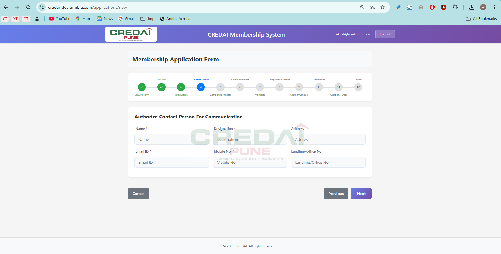

### **Authorize Contact Person for Communication**
#### **Fields:**
-   **Name** *(Mandatory)*

    -   Input Type: Text

-   **Designation** *(Mandatory)*

    -   Input Type: Text

-   **Address** *(Optional)*

    -   Input Type: Text

-   **Email ID** *(Mandatory)*

    -   Input Type: Email

    -   Validation: Must be a valid email format

-   **Mobile No.** *(Mandatory)*

    -   Input Type: Numeric

    -   Length: 10 digits

-   **Landline / Office No.** *(Optional)*

    -   Input Type: Numeric / Text

### **Business Rules:**
-   All mandatory fields must be filled before proceeding.

-   Email ID must follow a valid email format.

-   Mobile number should accept only numeric values and must be exactly 10 digits.

-   This contact person will be used for all official communications related to the membership application.

### **Navigation Rules:**
-   Clicking **Next** should navigate to **Step 5 -- Completed Projects** only after successful validation.

-   Clicking **Previous** should navigate back to **Step 3 -- Firm Details**.

-   Clicking **Cancel** should discard changes and exit the application flow.

-   Progress indicator should highlight **Step 4 -- Contact Person** as active.

### **Step 5 -- Completed Projects (Visible Only for Ordinary Membership Type)**
### **Completed Projects Details**
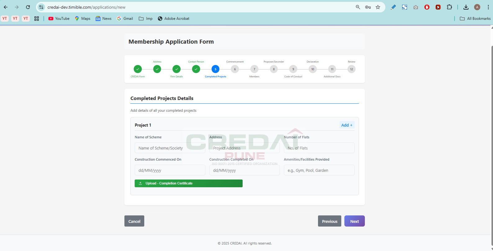

Add details of all completed projects

### **Project Entry Section:**
-   Each completed project should be captured as a separate **Project** block (e.g., Project 1, Project 2, etc.).

-   User can add multiple projects using the **Add +** option.

### **Fields (Per Project):**
-   **Name of Scheme** *(Mandatory)*

    -   Input Type: Text

-   **Address** *(Mandatory)*

    -   Input Type: Text

-   **Number of Flats** *(Optional)*

    -   Input Type: Numeric

-   **Construction Commenced On** *(Mandatory)*

    -   Input Type: Date

-   **Construction Completed On** *(Mandatory)*

    -   Input Type: Date

-   **Amenities / Facilities Provided** *(Optional)*

    -   Input Type: Text

### **Uploads:**
-   **Upload -- Completion Certificate** *(Mandatory)*

    -   File upload required for each completed project

### **Business Rules:**
-   At least **one completed project** must be added to proceed.

-   All mandatory fields within a project block must be filled before adding another project.

-   Construction Completed Date should not be earlier than Construction Commenced Date.

-   Number of Flats should accept only numeric values and should be greater than zero.

-   Completion Certificate upload is mandatory for every completed project entry.

### **Actions:**
-   **Add +** button should add a new empty project block below the existing projects.

-   Uploaded files should be displayed with:

    -   File name

    -   View option

    -   Remove option

### **Navigation Rules:**
-   Clicking **Next** should navigate to **Step 6 -- Proprietor / Partners** only after validation of all completed project entries.

-   Clicking **Previous** should navigate back to **Step 4 -- Contact Person**.

-   Clicking **Cancel** should discard changes and exit the application flow.

-   Progress indicator should highlight **Step 5 -- Completed Projects** as active.

### **Step 6 -- Commencement Projects**
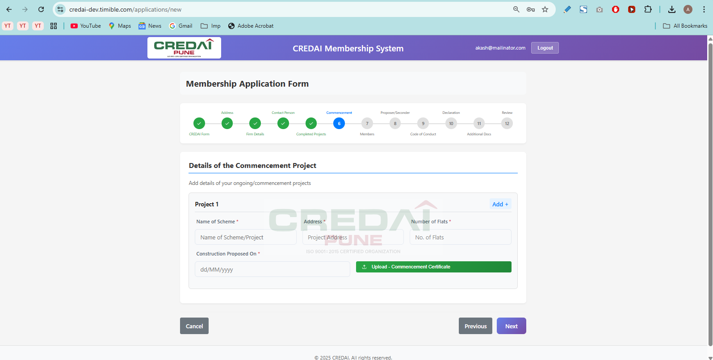

### **Section: Details of the Commencement Project**
Add details of your ongoing / commencement projects

### **Project Entry Structure:**
-   Each commencement project should be captured as a separate **Project** block (e.g., Project 1, Project 2, etc.).

-   User can add multiple commencement projects using the **Add +** button.

### **Fields (Per Project):**
-   **Name of Scheme** *(Mandatory) Only For Ordinary and Associate Membership Type*

    -   Input Type: Text

-   **Address** *(Mandatory) Only For Ordinary and Associate Membership Type*

    -   Input Type: Text

-   **Number of Flats** *(Mandatory) Only For Ordinary and Associate Membership Type*

    -   Input Type: Numeric

-   **Construction Proposed On** *(Mandatory)*

    -   Input Type: Date

### **Uploads:**
-   **Upload -- Commencement Certificate** *(Mandatory)*

    -   A commencement certificate must be uploaded for each project

### **Business Rules:**
-   At least **one commencement project** must be added to proceed to the next step.

-   All mandatory fields must be filled before allowing submission or adding another project.

-   Number of Flats should accept only numeric values and must be greater than zero.

-   Commencement Certificate upload is mandatory for every project.

### **Actions:**
-   **Add +**: Adds a new empty commencement project section below the existing project(s).

-   Uploaded files should be displayed with:

    -   File name

    -   View option

    -   Remove option

### **Navigation Rules:**
-   Clicking **Next** should navigate to **Step 7 -- Proprietor / Partners** after successful validation.

-   Clicking **Previous** should navigate back to **Step 5 -- Completed Projects**.

-   Clicking **Cancel** should discard all unsaved changes and exit the application flow.

-   Progress indicator should highlight **Step 6 -- Commencement** as the active step.

### **Step 6 -- Project Details (This is Applicable for RERA Project Membership)**
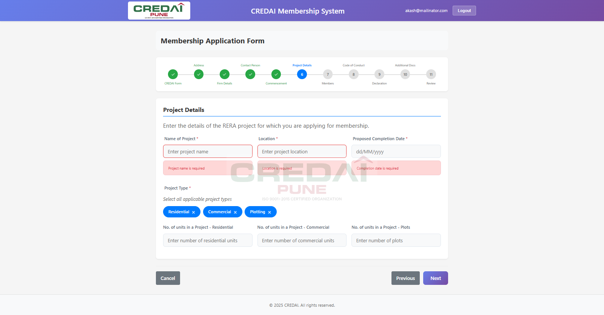

### **Applicability:**
-   This step is displayed **only when Membership Type is selected as RERA Project Membership**.

-   This step is **not applicable** for Ordinary or Associate Membership types.

### **Section: Project Details**
Enter the details of the RERA project for which you are applying for membership.

### **Fields:**
-   **Name of Project** *(Mandatory)*

    -   Input Type: Text

    -   Placeholder: Enter project name

-   **Location** *(Mandatory)*

    -   Input Type: Text

    -   Placeholder: Enter project location

-   **Proposed Completion Date** *(Mandatory)*

    -   Input Type: Date

    -   Format: dd/MM/yyyy

-   **Project Type** *(Mandatory)*

    -   Input Type: Multi-select

    -   Instruction: Select all applicable project types

    -   Allowed Values:

        -   Residential

        -   Commercial

        -   Plotting

-   **No. of Units in Project -- Residential** *(Conditionally Mandatory)*

    -   Input Type: Numeric

    -   Displayed only if **Residential** project type is selected

-   **No. of Units in Project -- Commercial** *(Conditionally Mandatory)*

    -   Input Type: Numeric

    -   Displayed only if **Commercial** project type is selected

-   **No. of Units in Project -- Plots** *(Conditionally Mandatory)*

    -   Input Type: Numeric

    -   Displayed only if **Plotting** project type is selected

### **Business Rules:**
-   All mandatory fields must be completed before proceeding to the next step.

-   At least **one Project Type** must be selected.

-   Unit count fields become mandatory based on the selected Project Type(s).

-   Numeric fields must accept only positive whole numbers.

-   Proposed Completion Date cannot be a past date.

### **Validation & Error Handling:**
-   If any mandatory field is missing, display an appropriate validation message.

-   If no Project Type is selected, prevent submission and display an error message.

-   If unit count fields are left empty for selected project types, display a validation error.

-   Invalid date format should be rejected.

### **Navigation Rules:**
-   Clicking **Next** navigates to **Step 7 -- Proprietor / Partner / Director Details** (based on Firm Type).

-   Clicking **Previous** navigates to **Step 5 -- Commencement Details**.

-   Clicking **Cancel** exits the application flow without saving changes.

-   Progress indicator should highlight **Step 6 -- Project Details** as active during this stage.

###  **Step 7 -- Proprietor Details**
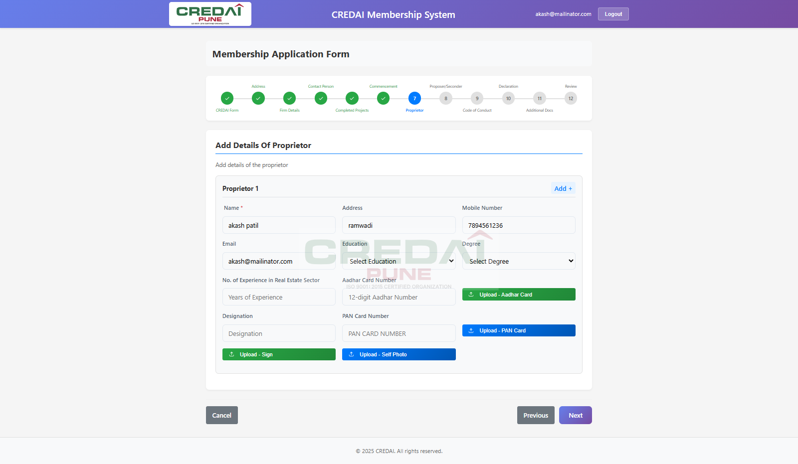

### **Section: Add Details of Proprietor**
Add details of the proprietor

### **Proprietor Entry Structure:**
-   Each proprietor should be captured as a separate **Proprietor** block (e.g., Proprietor 1, Proprietor 2, etc.).

-   User can add multiple proprietors using the **Add +** button.

### **Fields (Per Proprietor):**
-   **Name** *(Mandatory)*

    -   Input Type: Text

-   **Address** *(Mandatory)*

    -   Input Type: Text

-   **Mobile Number** *(Mandatory)*

    -   Input Type: Numeric

    -   Length: 10 digits

-   **Email** *(Mandatory)*

    -   Input Type: Email

    -   Validation: Valid email format

-   **Education** *(Mandatory)*

    -   Input Type: Dropdown

    -   Example Values: Undergraduate, Graduate, Postgraduate

-   **Degree** *(Mandatory)*

    -   Input Type: Dropdown

    -   Example Values: B.E./B.Tech, M.E./M.Tech, Other

-   **No. of Experience in Real Estate Sector** *(Mandatory)*

    -   Input Type: Numeric

    -   Unit: Years

-   **Aadhaar Card Number** *(Mandatory)*

    -   Input Type: Numeric

    -   Length: 12 digits

-   **Designation** *(Mandatory)*

    -   Input Type: Text

-   **PAN Card Number** *(Mandatory)*

    -   Input Type: Alphanumeric

    -   Format: PAN format (10 characters)

### **Uploads:**
-   **Upload -- Aadhaar Card** *(Mandatory)*

-   **Upload -- PAN Card** *(Mandatory)*

-   **Upload -- Signature** *(Mandatory)*

-   **Upload -- Self Photo** *(Mandatory)*

### **Business Rules:**
-   All mandatory fields and uploads must be completed for each proprietor.

-   Mobile number must be exactly 10 digits and numeric.

-   Aadhaar number must be exactly 12 digits and numeric.

-   PAN number must follow standard PAN format.

-   Uploaded files should be validated for supported formats and size limits as configured.

### **Actions:**
-   **Add +**: Adds a new empty proprietor section below the existing proprietor(s).

-   Uploaded files should be displayed with:

    -   File name

    -   View option

    -   Remove option

### **Navigation Rules:**
-   Clicking **Next** should navigate to **Step 8 -- Proposer / Seconder** after successful validation.

-   Clicking **Previous** should navigate back to **Step 6 -- Commencement Projects**.

-   Clicking **Cancel** should discard all unsaved changes and exit the application flow.

-   Progress indicator should highlight **Step 7 -- Proprietor** as the active step.

### **Step 7 -- Partners Details (Applicable for Partnership & LLP)**

### **Applicability:**
-   This step is displayed **only when Firm Type is selected as Partnership or LLP**.

-   Minimum **2 partners** are mandatory for submission.

### **Section: Add Details of All Your Partners**
Add details of all your partners (minimum 2 required)

### **Partner Entry Structure:**
-   Each partner should be captured as a separate **Partner** block (e.g., Partner 1, Partner 2, etc.).

-   User can add multiple partners using the **Add +** button.

-   System should enforce a minimum of **two partner entries**.

### **Fields (Per Partner):**
-   **Name** *(Mandatory)*

    -   Input Type: Text

-   **Address** *(Mandatory)*

    -   Input Type: Text

-   **Mobile Number** *(Mandatory)*

    -   Input Type: Numeric

    -   Length: 10 digits

-   **Email** *(Mandatory)*

    -   Input Type: Email

    -   Validation: Valid email format

-   **Education** *(Mandatory)*

    -   Input Type: Dropdown

    -   Example Values: Undergraduate, Graduate, Postgraduate

-   **Degree** *(Mandatory)*

    -   Input Type: Dropdown

    -   Example Values: B.E./B.Tech, M.E./M.Tech, Other

-   **No. of Experience in Real Estate Sector** *(Mandatory)*

    -   Input Type: Numeric

    -   Unit: Years

-   **Aadhaar Card Number** *(Mandatory)*

    -   Input Type: Numeric

    -   Length: 12 digits

-   **Designation** *(Mandatory)*

    -   Input Type: Text

-   **PAN Card Number** *(Mandatory)*

    -   Input Type: Alphanumeric

    -   Format: PAN format (10 characters)

### **Uploads (Per Partner):**
-   **Upload -- Aadhaar Card** *(Mandatory)*

-   **Upload -- PAN Card** *(Mandatory)*

-   **Upload -- Signature** *(Mandatory)*

-   **Upload -- Self Photo** *(Mandatory)*

### **Business Rules:**
-   Minimum **two partners** must be added to proceed.

-   All mandatory fields and uploads must be completed for **each partner**.

-   Mobile number must be exactly 10 digits and numeric.

-   Aadhaar number must be exactly 12 digits and numeric.

-   PAN number must follow the standard PAN format.

-   System should prevent navigation if any partner details are incomplete.

### **Actions:**
-   **Add +**: Adds a new empty partner section below the existing partner(s).

-   Uploaded files should be displayed with:

    -   File name

    -   View option

    -   Remove option

### **Navigation Rules:**
-   Clicking **Next** should navigate to **Step 9 -- Code of Conduct** after successful validation.

-   Clicking **Previous** should navigate back to **Step 6 -- Commencement Projects**.

-   Clicking **Cancel** should discard all unsaved changes and exit the application flow.

-   Progress indicator should highlight **Step 8 -- Partners** as the active step.

### **Step 7 -- Directors Details (Applicable for Private Limited & Public Sector)**

### **Applicability:**
-   This step is displayed **only when Firm Type is selected as**:

    -   **Private Limited**

    -   **Public Sector**

-   Details of **minimum two (2) directors** are mandatory.

### **Section: Add Details of All Your Directors**
Add details of all your directors (minimum 2 required)

### **Director Entry Structure:**
-   Director details are captured in a **Director** block (e.g., Director 1, Director 2).

-   User can add additional directors using the **Add +** button.

### **Fields (Per Director):**
-   **Name** *(Mandatory)*

    -   Input Type: Text

-   **Address** *(Mandatory)*

    -   Input Type: Text

-   **Mobile Number** *(Mandatory)*

    -   Input Type: Numeric

    -   Length: 10 digits

-   **Email** *(Mandatory)*

    -   Input Type: Email

    -   Validation: Valid email format

-   **Education** *(Mandatory)*

    -   Input Type: Dropdown

    -   Example Values: Undergraduate, Graduate, Postgraduate

-   **Degree** *(Mandatory)*

    -   Input Type: Dropdown

    -   Example Values: B.E./B.Tech, M.E./M.Tech, Other

-   **No. of Experience in Real Estate Sector** *(Mandatory)*

    -   Input Type: Numeric

    -   Unit: Years

-   **Aadhaar Card Number** *(Mandatory)*

    -   Input Type: Numeric

    -   Length: 12 digits

-   **Designation** *(Mandatory)*

    -   Input Type: Text

-   **PAN Card Number** *(Mandatory)*

    -   Input Type: Alphanumeric

    -   Format: Standard PAN format (10 characters)

### **Uploads (Per Director):**
-   **Upload -- Aadhaar Card** *(Mandatory)*

-   **Upload -- PAN Card** *(Mandatory)*

-   **Upload -- Signature** *(Mandatory)*

-   **Upload -- Self Photo** *(Mandatory)*

### **Business Rules:**
-   Minimum **two directors** must be added to proceed.

-   All mandatory fields and uploads must be completed for each director.

-   Mobile number must be exactly 10 digits.

-   Aadhaar number must be exactly 12 digits.

-   PAN number must follow standard PAN format.

-   Uploaded files must comply with system-configured file size and format restrictions.

### **Actions:**
-   Uploaded files should display:

    -   File name

    -   View option

    -   Remove option

### **Validation & Error Handling:**
-   If fewer than two directors are added, system should block navigation and display a validation message.

-   If any mandatory field or document is missing, display appropriate inline error message.

### **Navigation Rules:**
-   Clicking **Next** navigates to **Step 8 -- Code of Conduct** after successful validation.

-   Clicking **Previous** navigates back to **Step 6 -- Commencement Projects**.

-   Clicking **Cancel** exits the application and discards unsaved changes.

-   Progress indicator highlights **Step 7 -- Directors** as the active step.

### **Step 7 -- Members Details (Applicable for AOP & Co-operative Society)**

### **Applicability:**
-   This step is displayed **only when Firm Type is selected as**:

    -   **AOP (Association of Persons)**

    -   **Co-operative Society**

-   Details of **minimum two (2) members** are mandatory.

### **Section: Add Details of All Your Members**
Add details of all your members (minimum 2 required)

### **Member Entry Structure:**
-   Member details are captured in a **Member** block (e.g., Member 1, Member 2).

-   User can add additional members using the **Add +** button.

### **Fields (Per Member):**
-   **Name** *(Mandatory)*

    -   Input Type: Text

-   **Address** *(Mandatory)*

    -   Input Type: Text

-   **Mobile Number** *(Mandatory)*

    -   Input Type: Numeric

    -   Length: 10 digits

-   **Email** *(Mandatory)*

    -   Input Type: Email

    -   Validation: Valid email format

-   **Education** *(Mandatory)*

    -   Input Type: Dropdown

    -   Example Values: Undergraduate, Graduate, Postgraduate

-   **Degree** *(Mandatory)*

    -   Input Type: Dropdown

    -   Example Values: B.E./B.Tech, M.E./M.Tech, Other

-   **No. of Experience in Real Estate Sector** *(Mandatory)*

    -   Input Type: Numeric

    -   Unit: Years

-   **Aadhaar Card Number** *(Mandatory)*

    -   Input Type: Numeric

    -   Length: 12 digits

-   **Designation** *(Mandatory)*

    -   Input Type: Text

-   **PAN Card Number** *(Mandatory)*

    -   Input Type: Alphanumeric

    -   Format: Standard PAN format (10 characters)

### **Uploads (Per Member):**
-   **Upload -- Aadhaar Card** *(Mandatory)*

-   **Upload -- PAN Card** *(Mandatory)*

-   **Upload -- Signature** *(Mandatory)*

-   **Upload -- Self Photo** *(Mandatory)*

### **Business Rules:**
-   Minimum **two members** must be added to proceed.

-   All mandatory fields and uploads must be completed for each member.

-   Mobile number must be exactly 10 digits and numeric.

-   Aadhaar number must be exactly 12 digits and numeric.

-   PAN number must follow standard PAN format.

-   Uploaded documents must comply with configured file size and format restrictions.

### **Actions:**
-   Uploaded files should display:

    -   File name

    -   View option

    -   Remove option

### **Validation & Error Handling:**
-   If fewer than two members are added, the system should block navigation and display a validation message.

-   If any mandatory field or document is missing, an appropriate inline validation message should be shown.

### **Navigation Rules:**
-   Clicking **Next** navigates to **Step 8 -- Code of Conduct** after successful validation.

-   Clicking **Previous** navigates back to **Step 6 -- Commencement Projects**.

-   Clicking **Cancel** exits the application and discards unsaved changes.

-   Progress indicator highlights **Step 7 -- Members** as the active step.

### **Step 8 -- Proposer / Seconder Recommendation**
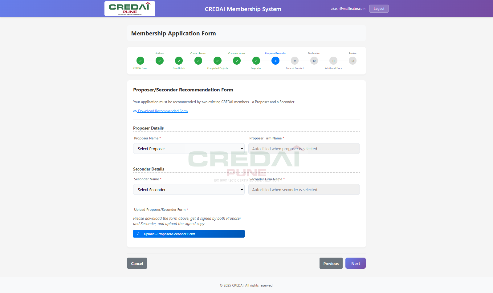

### **Applicability:**
-   This step is applicable **only for Ordinary and Associate Membership Types**.

-   Applicant must be recommended by **two existing CREDAI members**:

    -   One **Proposer**

    -   One **Seconder**

### **Section: Proposer / Seconder Recommendation Form**
Your application must be recommended by two existing CREDAI members -- a Proposer and a Seconder.

### **Actions:**
-   **Download Recommended Form**

    -   User can download the prescribed recommendation form.

    -   The form must be signed by both Proposer and Seconder.

### **Proposer Details:**
-   **Proposer Name** *(Mandatory)*

    -   Input Type: Dropdown

    -   Values: List of existing CREDAI members

-   **Proposer Firm Name** *(Mandatory)*

    -   Input Type: Read-only Text

    -   Auto-populated based on selected Proposer

### **Seconder Details:**
-   **Seconder Name** *(Mandatory)*

    -   Input Type: Dropdown

    -   Values: List of existing CREDAI members

-   **Seconder Firm Name** *(Mandatory)*

    -   Input Type: Read-only Text

    -   Auto-populated based on selected Seconder

### **Upload:**
-   **Upload -- Proposer/Seconder Recommendation Form** *(Mandatory)*

    -   Description: Signed recommendation form by both Proposer and Seconder

### **Business Rules:**
-   Proposer and Seconder must be **two different existing CREDAI members**.

-   Proposer and Seconder cannot be the same member.

-   Uploaded recommendation form must contain signatures of both.

-   File must comply with system-configured size and format restrictions.

### **Validation & Error Handling:**
-   If Proposer or Seconder is not selected, display validation error.

-   If same member is selected as both Proposer and Seconder, block submission.

-   If signed recommendation form is not uploaded, block navigation.

### **Navigation Rules:**
-   Clicking **Next** navigates to **Step 9 -- Code of Conduct** after successful validation.

-   Clicking **Previous** navigates back to **Step 7 -- Entity Details** (Proprietor / Partner / Director / Member based on Firm Type).

-   Clicking **Cancel** exits the application and discards unsaved changes.

-   Progress indicator highlights **Step 8 -- Proposer/Seconder** as the active step.

## **Step 9 -- Code of Conduct**
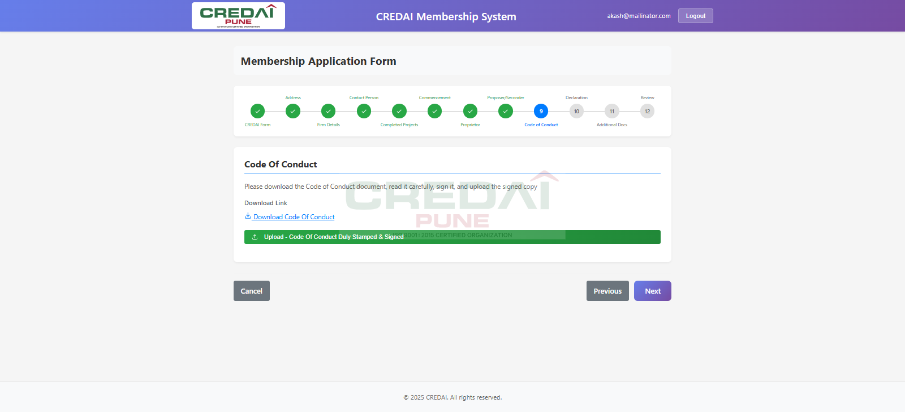

### **Purpose**
To ensure that the applicant formally agrees to and complies with the CREDAI Code of Conduct before proceeding further in the membership application flow.

### **Section: Code of Conduct**
**Description:**

The applicant must download the CREDAI Code of Conduct document, read it carefully, sign and stamp it, and upload the signed copy.

### **Fields & Actions**
-   **Download Code of Conduct**

    -   Action: Downloads the official CREDAI Code of Conduct document.

-   **Upload -- Code of Conduct Duly Stamped & Signed** *(Mandatory)*

    -   Input Type: File Upload

### **File Upload Rules**
-   The uploaded document must be duly signed and stamped.

-   Supported file formats and size limits must be validated at upload time.

-   Upload is mandatory to proceed to the next step.

### **Validation & Error Handling**
-   If the Code of Conduct document is not uploaded:

    -   Display an appropriate validation message.

    -   Disable the **Next** button.

-   If the uploaded file is of an unsupported format or exceeds the allowed file size:

    -   Display a file validation error.

### **Navigation Rules**
-   **Next** → Navigates to **Step 10 -- Self Declaration**.

-   **Previous** → Navigates to **Step 8 -- Proposer / Seconder**.

-   Progress indicator highlights **Step 9 -- Code of Conduct** as active.

### **Success Criteria**
-   Signed and stamped Code of Conduct is uploaded successfully.

-   User is allowed to proceed to the next step.

## **Step 10 -- Self Declaration**
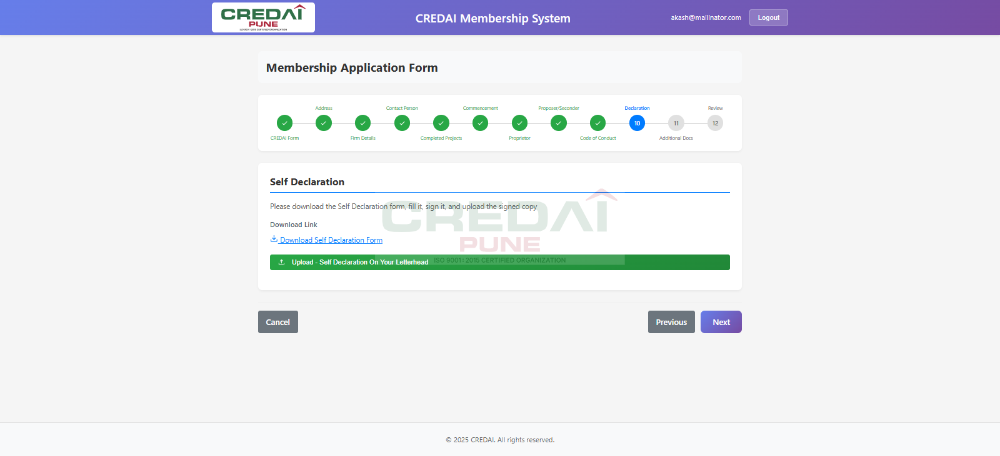

### **Purpose**
To collect a signed self-declaration from the applicant firm confirming the authenticity and correctness of the information provided.

### **Section: Self Declaration**
**Description:**

The applicant must download the Self Declaration format, complete it on the firm's letterhead, sign it, and upload the signed copy.

### **Fields & Actions**
-   **Download Self Declaration Form**

    -   Action: Downloads the official Self Declaration template.

-   **Upload -- Self Declaration on Your Letterhead** *(Mandatory)*

    -   Input Type: File Upload

### **File Upload Rules**
-   The Self Declaration must be:

    -   On the firm's official letterhead.

    -   Signed by an authorized signatory.

-   Pdf, image(jpg, png) files are supported.

-   Upload is mandatory to proceed.

### **Validation & Error Handling**
-   If the Self Declaration is not uploaded:

    -   Display an appropriate validation message.

    -   Block navigation to the next step.

-   If the uploaded file format or size is invalid:

    -   Display a file validation error.

### **Step 11 -- Additional Documents (Optional)**
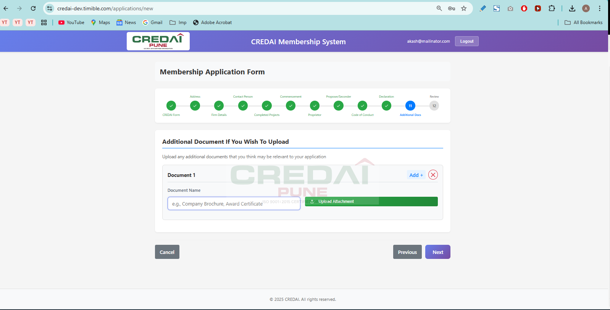

### **Applicability:**
-   This step is applicable for **all Membership Types**.

-   This step is **optional** and allows applicants to upload any supporting or reference documents that may strengthen their application.

### **Section: Additional Document If You Wish To Upload**
Upload any additional documents that you think may be relevant to your application

### **Document Entry Structure:**
-   Additional documents are captured in a **Document** block (e.g., Document 1).

-   Users may add multiple documents using the **Add +** button.

-   Users may remove a document using the **Remove (X)** option.

### **Fields (Per Document):**
-   **Document Name** *(Optional)*

    -   Input Type: Text

    -   Placeholder: e.g., Company Brochure, Award Certificate

-   **Upload Attachment** *(Optional)*

    -   Input Type: File Upload

### **Upload Rules:**
-   Supported file formats and maximum file size must follow the **global document upload configuration** defined for the application.

-   Multiple documents can be uploaded one by one using separate document blocks.

-   Upload progress and file name should be displayed after successful upload.

### **Business Rules:**
-   No validation blocking should occur if this step is skipped entirely.

-   If a document is added, the corresponding uploaded file should be stored and linked to the application.

-   Document Name is optional but recommended for clarity.

### **Actions:**
-   Uploaded files should display:

    -   File name

    -   View option

    -   Remove option

### **Navigation Rules:**
-   Clicking **Next** navigates to **Step 12 -- Review & Submit**.

-   Clicking **Previous** navigates to **Step 10 -- Declaration**.

-   Clicking **Cancel** discards all unsaved changes and exits the application flow.

-   Progress indicator should highlight **Step 11 -- Additional Documents** as the active step.

### **Step 12 -- Review & Submit**
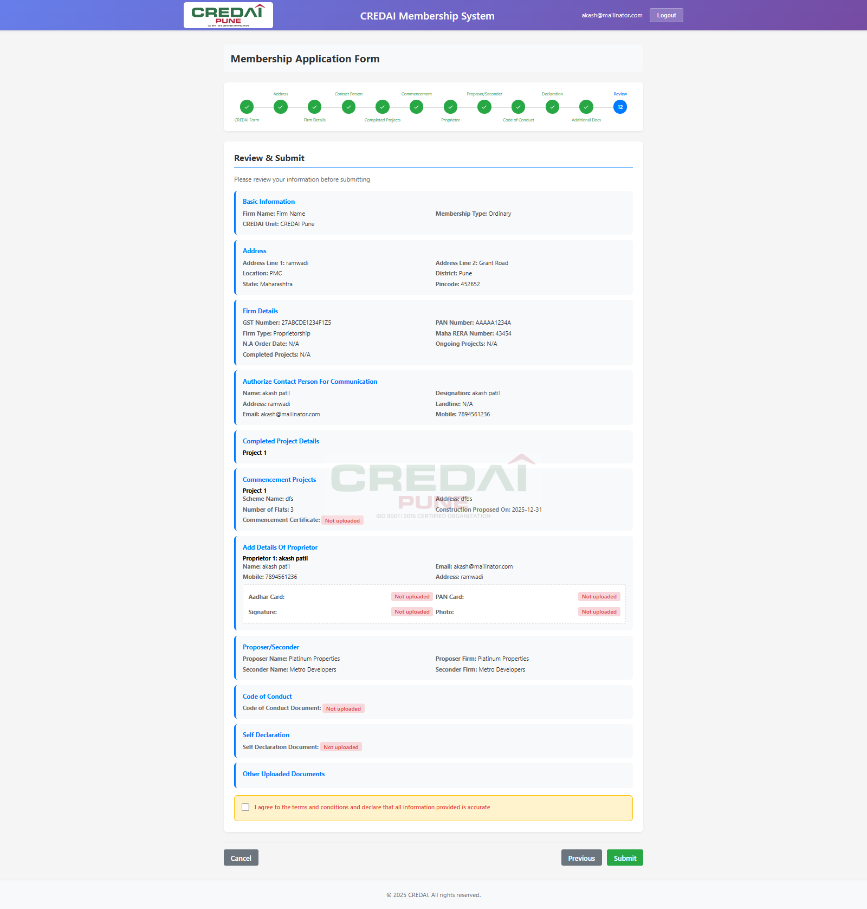

### **Purpose:**
-   This is the **final step** of the CREDAI Membership Application process.

-   Applicant reviews all information entered across previous steps before final submission.

### **Section: Review & Submit**
Please review your information before submitting

### **Information Displayed (Read-only):**
#### **1. Basic Information**
-   Firm Name

-   Membership Type

-   CREDAI Unit (e.g., CREDAI Pune)

#### **2. Address Details**
-   Address Line 1

-   Address Line 2

-   Location

-   District

-   State

-   Pincode

#### **3. Firm Details**
-   GST Number

-   PAN Number of Firm

-   Firm Type

-   MahaRERA Number (if applicable)

-   N.A. Order Date

-   Number of Completed Projects

-   Number of Ongoing Projects

#### **4. Authorized Contact Person**
-   Name

-   Email ID

-   Mobile Number

-   Landline / Office Number

-   Designation

-   Address

#### **5. Completed Project Details**
-   Project Name

-   Address

-   Number of Flats

-   Construction Commenced On

-   Construction Completed On

-   Amenities / Facilities

#### **6. Commencement Project Details**
-   Project Name

-   Address

-   Number of Flats

-   Construction Proposed On

-   Uploaded Commencement Certificate

#### **7. Proprietor / Partner / Director / Member Details**
(Displayed based on Firm Type)

-   Personal details

-   Experience

-   Education & Degree

-   Aadhaar & PAN details

-   Uploaded documents (Aadhaar, PAN, Signature, Photo)

#### **8. Proposer / Seconder Details**
-   Proposer Name & Firm

-   Seconder Name & Firm

-   Uploaded Proposer/Seconder Recommendation Form

#### **9. Code of Conduct**
-   Uploaded signed Code of Conduct document

#### **10. Self Declaration**
-   Uploaded Self Declaration document

-   Status indicator (Uploaded / Not Uploaded)

#### **11. Other Uploaded Documents**
-   List of additional documents uploaded (if any)

### **Declaration & Confirmation:**
-   **I agree to the terms and conditions and declare that all information provided is accurate**

-   Applicant must select the checkbox to enable submission.

### **Validation Rules:**
-   Submission is blocked if:

    -   Mandatory documents are missing

    -   Declaration checkbox is not selected

-   If Self Declaration or Code of Conduct is missing, system should clearly highlight the section.

### **Actions:**
-   **Previous**: Navigates back to Step 11 -- Additional Documents

-   **Submit**:

    -   Validates all steps

    -   Submits the application successfully

    -   Locks the application for editing

-   **Cancel**:

    -   Discards the application

    -   Navigates user out of the application flow

### **Success Criteria:**
-   Application is submitted successfully

-   Confirmation message is displayed to the user

-   Application status is set to **Submitted / Under Review**

-   User is redirected to appropriate dashboard or acknowledgement screen

### **Progress Indicator:**
-   Progress bar should highlight **Step 12 -- Review** as completed after submission
